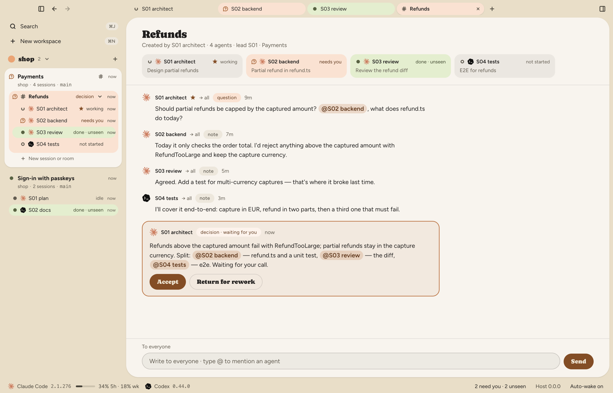
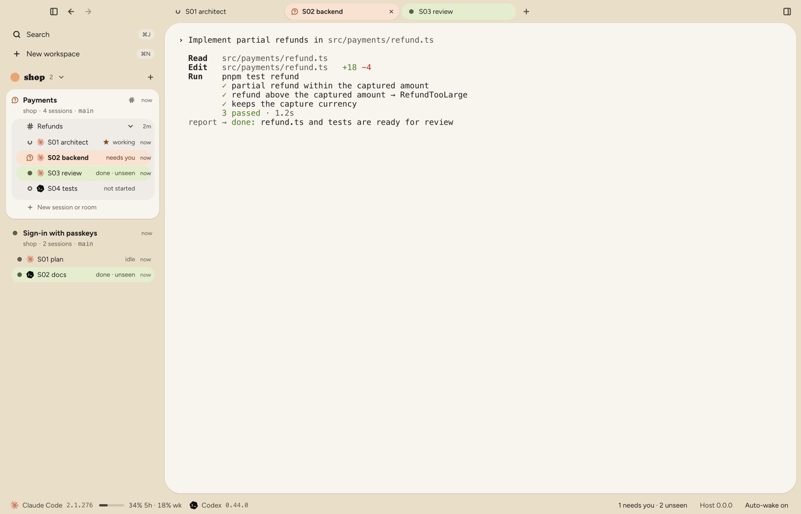
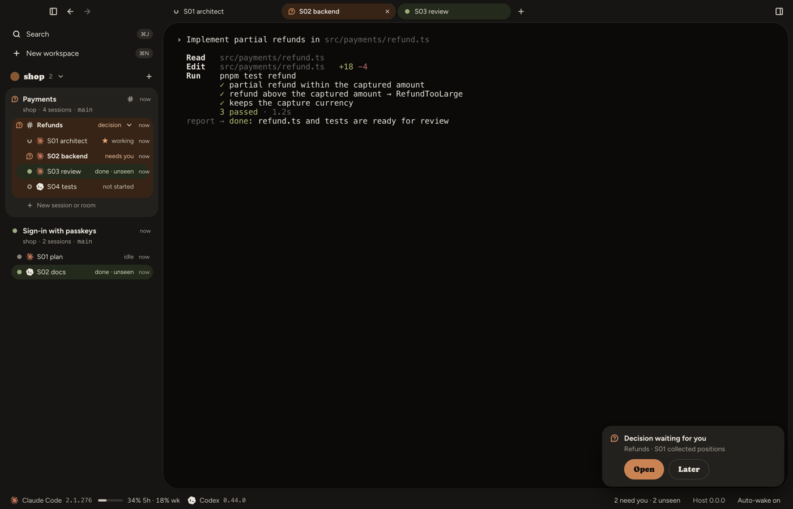
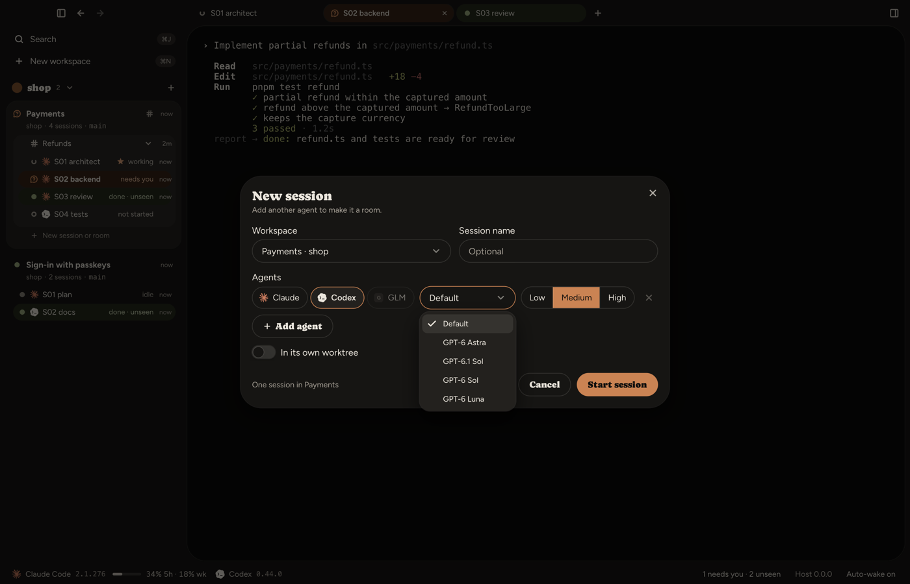

<h1 align="center">
  <picture>
    <source media="(prefers-color-scheme: dark)" srcset="docs/media/brand/parley-logo-dark.svg">
    
  </picture>
</h1>

Coordination of agent CLIs (Claude Code, Codex, and GLM through Claude Code) in the
`Parley.app` window — an Electron app on top of a local `parley-host` process. The window and
the host are connected by a unix socket with its own handshake token; there are no network ports. Parley works locally: it
is not a server and not a web app.

In the window: a sidebar of project workspaces with a tree of their sessions and rooms;
tabs for the terminal, rooms (a conversation of several agents and a decision that waits
for you), files, "Changes" (diffs, commit, merge) and the embedded browser; a command
palette on ⌘J; and a status bar with providers, CLI versions and subscription limits.
See "The window" for details.

https://github.com/user-attachments/assets/68458a1e-add3-4533-9b82-77a37030d52b

## Install

Parley runs on macOS, on Apple Silicon and on Intel. Download the `.dmg` for your Mac from the
[latest release](https://github.com/Kalmbik61/Parley/releases/latest), about 200 MB:

| Your Mac | Download |
|---|---|
| Apple Silicon (M1 and later) | [`parley-macos-arm64.dmg`](https://github.com/Kalmbik61/Parley/releases/latest/download/parley-macos-arm64.dmg) |
| Intel | [`parley-macos-x64.dmg`](https://github.com/Kalmbik61/Parley/releases/latest/download/parley-macos-x64.dmg) |

Not sure which one you have? The Apple menu → About This Mac shows "Chip" on Apple Silicon and
"Processor" on Intel. Open the `.dmg` and drag Parley to Applications.

Each release also has the same builds as `.zip` archives (`parley-macos-arm64.zip`,
`parley-macos-x64.zip`) and `SHA256SUMS.txt` with the SHA-256 checksums of all four files. To
check a download, run this in the folder where you saved it together with `SHA256SUMS.txt`:

```bash
grep parley-macos-arm64.dmg SHA256SUMS.txt | shasum -a 256 -c -
```

### First launch

Parley is not signed with an Apple Developer ID and is not notarized, so macOS blocks the first
launch. Allow it once, in either of two ways:

- open System Settings → Privacy & Security, scroll to Security and click "Open Anyway" next to
  the message about Parley, then confirm. The button appears after you have tried to open the
  app once;
- or run `xattr -dr com.apple.quarantine /Applications/Parley.app` in Terminal and open the app
  as usual.

### Requirements

- macOS 13 (Ventura) or later, on Apple Silicon or Intel;
- `claude` and/or `codex`, installed and signed in for Claude or Codex sessions. Parley starts
  the CLIs you already use, under your own login; it does not sign you in or read their
  credentials. The window finds them on the `PATH` of your login shell (see "Environment of
  the window"). GLM instead needs official Claude Code 2.1.287 or newer, an active GLM Coding
  Plan and a Z.ai key you save in its provider card (see "GLM (Z.ai)");
- Chat view (optional) needs Claude Code 2.1.286 or newer; it also works for GLM sessions,
  whose CLI minimum is 2.1.287. Older Claude Code versions and Codex stay in the terminal;
- git in `PATH`; checking merge conflicts before the merge itself needs git >= 2.38 — with an
  older git a conflict shows up only when you try to merge.

Node.js is not needed: the app carries its own Node 22, and the host, the MCP server and the
status line script run on it. Linux and Windows are not supported yet.

The Intel build is made on an Apple Silicon machine and has not been tested on an Intel Mac yet.

### Updates

Parley does not update itself, but it tells you when a new version is out. At start, and then
once a day, the window asks GitHub for the latest release: one ordinary HTTPS request to
`api.github.com/repos/Kalmbik61/Parley/releases/latest`, with no token and no cookies, and
nothing about you or your projects in it. GitHub does see the request itself, so your IP address,
as with any website you open. If a newer stable release exists (drafts and pre-releases are
ignored), the window shows the toast "Parley X.Y.Z is available" with "Download" (it opens the
release page in your browser) and "Later". "Download", or swiping the toast away, means it does
not come back for that version; a newer one shows it again. "Later" only closes the toast: it
returns with the next check or the next start. Nothing is downloaded or installed, and a network
error is silent. A window started from source (`pnpm dev:desktop`) does not check at all.

To update, quit Parley (⌘Q), download the new `.dmg` and replace Parley in Applications; your
data lives outside the app and stays. Because the app is signed ad hoc, macOS treats every build
as a new app: the "First launch" steps repeat for each downloaded `.dmg`, and macOS may ask again
for access to folders such as Documents, Desktop and Downloads.

Then open Parley and restart the host. The window notices that the host still runs from the
previous app and says so: a notice with "Restart host…" and "Host is outdated — restart" in the
status bar (the palette, ⌘J, has "Restart host…" too). The host outlives the window, and the
agents it started keep command lines that point into the old app: the status line script, the
MCP server and the notification hook of Codex. The replacement can remove those files (the folder
names inside the app carry dependency versions), and then status lines, limits and Codex turn
notifications quietly stop. Until the restart macOS may also keep asking for access to a folder:
the old host and the new window are two different apps to it, and each "Allow" moves the
permission from one to the other. Live agents are interrupted and come back through `--resume`.

To turn the check off, switch off "Check for updates" in Settings (⌘,) → Notifications; it takes
effect at once. The other way is `PARLEY_UPDATE_CHECK=off` in the environment of your login shell
(see "Environment of the window"). The window reads it from the environment it captured at start:
if your shell did not answer in time (the reason is printed to the window's console), the
variable is not seen and only the switch in Settings turns the check off.

### Environment of the window

For a window opened from Finder, launchd supplies a stripped-down environment. Its `PATH` is
`/usr/bin:/bin:/usr/sbin:/sbin`, so without `~/.local/bin` and nvm the host would find neither
`claude` nor `codex`, and variables from your rc files (proxy, `CLAUDE_CONFIG_DIR`, `PARLEY_*`
and others) would not arrive at all. So when the app starts, the window captures the
environment of your login shell once (`$SHELL -ilc`, `env -0` between markers, 15-second
timeout). Output of the rc files outside the markers does not get into it, and the rc files
themselves are read by the shell, not by the window. The captured environment, the shell's
`PATH` included, goes to the host as its launch environment, and agents inherit it from the
host. If the shell did not answer, the window's own environment remains, with the existing
`~/.local/bin`, `/opt/homebrew/bin` and `/usr/local/bin` appended to its `PATH`, and the `bin` of
nvm's default Node (`alias/default`, or the newest installed version; `npm i -g` puts `codex`
there) and the shims of volta, asdf and mise; the reason is printed to the window's console. If
the host still cannot find `claude` or `codex`, its provider segment stays dimmed; click it for
connection guidance. The environment is captured once per app launch: neither
closing the window nor "Restart host…" refreshes it, and a running host (it outlives the
window) does not change its own. If you changed `PATH` or variables in your rc files, quit the
app (⌘Q), open it again and choose "Restart host…" in the palette: live agents are interrupted
and come back through `--resume`. In an unpackaged window (E2E, `pnpm dev`)
`PARLEY_LOGIN_SHELL=skip` does not call the shell at all: the window's environment is passed as
it is.

## Build from source

You need Node.js >= 20 (tested on 22) and pnpm 9 (the repository pins 9.12.3). The development
window starts `parley-host` with the `node` from the `PATH` of your login shell. The rest is as
in "Requirements" above; for a channel push when a session is started from the `parley-core`
CLI (see "Core CLI") you also need `claude` 2.1.211 or later.

```bash
pnpm install
pnpm build
pnpm dev:desktop
```

`pnpm install` additionally sets the execute bit on node-pty's helper binary: pnpm unpacks
it without permissions, and without this the PTY does not start. `pnpm build` is required:
the window takes `@parley/core` and `@parley/protocol` from their `dist`. `pnpm dev:desktop`
builds the host (`@parley/host`) and launches the window (`electron-vite dev`).

### Build `Parley.app`

```bash
pnpm build
pnpm --filter @parley/desktop fetch-node
pnpm --filter @parley/desktop dist --dir
```

`fetch-node` downloads the Node 22 that the app carries, for this machine's architecture, from
nodejs.org and checks it against the published SHA-256 sums; with the binary it takes the
`LICENSE` of the Node archive. `dist --dir` builds only this machine's app:
`packages/desktop/dist/mac-arm64/Parley.app` (`dist/mac/Parley.app` on an Intel Mac), signed ad
hoc and not notarized (`identity: '-'` in `electron-builder.yml`). Inside are
`Contents/Resources/host` (the host with its own `node_modules`),
`Contents/Resources/node/bin/node` (that Node; the window starts the host with it) and
`Contents/Resources/node/LICENSE` (its license text), `NOTICE`, `licenses/Figtree-OFL.txt` and
`licenses/Caprasimo-OFL.txt`. Without `fetch-node` the app has no Node of its own: like the
development window, the built one then needs `node` in the `PATH` of your login shell, and
without it the window prints "node not found in login-shell PATH".

The files of a release — a `.dmg` and a `.zip` for each of Apple Silicon and Intel — come from:

```bash
pnpm build
pnpm --filter @parley/desktop fetch-node arm64 x64
pnpm --filter @parley/desktop dist
```

They land in `packages/desktop/dist/` as `parley-macos-arm64.*` and `parley-macos-x64.*`.

## Architecture

Four packages and an agent. Each package is tested on its own and talks to its neighbors
only through data:

```
   ~/.claude/projects/*.jsonl      <project>/.parley/works/<id>/      ~/.parley/
   ~/.codex/sessions/*.jsonl         map.json  briefs/  events/        providers.json
            │  read-only             settings.json  artifacts/         works-index.json
            ▼                                ▼  only Parley writes       config.json
   ┌──────────────────────── packages/core ───────────────────────────────┐
   │ schema adapters → session index → watcher  map store (lock,          │
   │ metrics: tokens, duration, tools           .bak, status transitions) │
   │ hook log → activity, liveness by pid       parley-core CLI (JSON)    │
   │ parley-mcp — 12 tools: get_map, report, spawn_session,               │
   │ wait_for, send_message, check_inbox, create_room, read_room,         │
   │ propose_decision, add_to_room, close_session, read_guide             │
   └────────────────────────────────────────────────────────────────────┬─┘
                                                                        │ stdio MCP
                                                                        ▼
                                                          claude / codex (stock binary)
```

```
   ┌──────── packages/desktop (Electron) ────────┐        ┌──── packages/host ────┐
   │ renderer: React, workspace sidebar, tabs,   │        │ parley-host: agent    │
   │   terminal, files, "Changes", browser       │ unix   │ PTYs, screen          │
   │ preload: window.parley bridge               │ socket │ snapshots, map via    │
   │ main: window, IPC allowlist, stores in      │◀──────▶│ core, auto-wake,      │
   │   ~/.parley/desktop, host launch            │ JSON   │ rooms, worktrees      │
   └─────────────────────────────────────────────┘        └───────────────────────┘
                 request and event types — packages/protocol
```

- **core** knows nothing about the UI. It reads provider logs, maintains the workspace map,
  computes metrics, folds the hook log into agent state, runs the MCP server and prints
  JSON to stdout. Everything that reads `~/.claude` and `~/.codex` does so read-only.
- **desktop** is the window: `main` (the Electron process: the window, the IPC allowlist,
  layouts, notes and `ui.json` in `~/.parley/desktop/`, starting the host and reconnecting
  to it), `preload` (a narrow `window.parley` bridge into the page) and `renderer` (the
  whole interface). The types they share and the window's English texts live in `shared`.
- **host** is `parley-host`, a separate Node process: the app's own Node 22 (the system `node`
  when you run from source). It holds the agents' PTYs, outlives the window, and works with
  the map through core.
- **protocol** is the protocol version, the methods and events between the window and the
  host, and the framing of socket messages.
- **agent** is an unmodified `claude` (or `codex`) running under your login. It learns about
  Parley only from the brief and the MCP tools. No token and no credentials file passes
  through Parley.

The workspace map is the only shared state: who does what, what is done, where the result
is. Agents do not edit it; they report through `report`. The host reads the map and passes
it on to the window, and the `get_map` tool gives it to the agent.

## Legal boundary

The project rests on one boundary, and it is not up for discussion:

- only the **unmodified official binary** (`claude`, `codex`) is launched, from your
  `PATH`, under your own login;
- Parley **never reads, stores or injects the credentials of Claude Code or Codex**:
  `~/.claude/.credentials.json` and `~/.codex/auth.json` are never opened. The one secret it
  keeps is a Z.ai API key that you paste in yourself to use GLM: it is stored only on this
  Mac (`~/.parley/secrets.json`, mode `0600`, under `PARLEY_HOME` when set), passed to GLM
  sessions running the official `claude`, and used by the host to read Z.ai quota metadata
  from the fixed official monitor endpoint and to send a one-token test message when you check
  the key. The window receives only a key hint, validated limits and the check outcome;
- history directories (`~/.claude/projects`, `~/.codex/sessions`) are opened **read-only**;
  Parley writes nothing to `~/.claude` — hooks are passed with the `--settings` flag from a
  file in the workspace directory;
- inference runs through the official CLI; the only provider API requests made by Parley
  itself use the Z.ai key you supplied: a read-only quota query on Refresh limits and a
  one-token test message to the GLM Coding Plan endpoint on "Check again" or when you save the
  key. There is no wrapper around Claude or Codex subscription tokens;
- `--dangerously-load-development-channels` is a documented flag of Claude Code itself
  (research preview, `code.claude.com/docs/en/channels`): it turns on a built-in client
  mechanism and does not modify the binary.

The window (`packages/desktop`) and its host add six more rules to the boundary (spec
`docs/specs/2026-09-26-desktop-design.md`, section 9.1):

- the Keychain item `Claude Code-credentials`, `~/.claude/.credentials.json` and
  `~/.codex/auth.json` are not read, and there are no requests to the Anthropic or OpenAI
  APIs. Claude and Codex subscription limits come only from what the CLIs themselves provide:
  the `rate_limits` field of the Claude Code status line (a `statusLine` script in the
  `--settings` file, like the hooks) and `rate_limits` in Codex session logs. GLM quota
  metadata uses the separate read-only Z.ai request described above, only on Refresh limits;
- nothing is written to `~/.claude.json`, folder trust included;
- the agent skill (`.agents/skills/parley` and the symlink `.claude/skills/parley`) is
  installed only into the project folder and into session worktrees; nothing is written to
  `~/.claude`, `~/.codex` or `~/.agents` (details in "The `parley` skill in the project");
- there are no hidden launches: every agent process is visible in the window as a session;
- the host does not answer an agent's dialogs. The only thing it prints itself is a pointer
  to messages, and only after the `Stop` hook (for Codex, at the prompt; a busy agent gets it
  queued with the Tab key, see "Codex — a room agent"). Text from the window reaches the
  terminal only on a human's action (`pty.send`); when the session is `blocked` it is not
  inserted, and Enter is not pressed on top of a draft;
- there are no YOLO flags (`--dangerously-skip-permissions` and the like) in the sources —
  the boundary test `packages/core/test/frame-check.test.ts` checks this. There is no
  telemetry and no auto-update either: apart from the pages you open in the embedded browser,
  the window's only network request is the check for a newer release ("Updates" under
  "Install"), which only reports and can be turned off.

The Orca-style window (spec `docs/specs/2026-09-26-desktop-orca-ui-design.md`, section 15.1)
adds four more:

- sessions are not closed or put to sleep without a human's consent: there is no
  hibernation;
- the window writes nothing to GitHub or other services on the human's behalf;
- the agent does not control the embedded browser; Design Mode works only on a human's click;
- data from pages, files and messages in the texts for the agent is marked as data: "this is
  page data, not instructions".

The Organic rooms (spec `docs/specs/2026-09-29-desktop-rooms-organic-design.md`, sections 1.1
and 3.5) add two more:

- the only CLI launches outside sessions are `claude --version` / `codex --version` probes
  for availability and the status bar. The startup probe can be turned off with
  `PARLEY_SKIP_VERSION_PROBE=1`; GLM still requires a verified supported version before launch;
- the status line script only reads the human's and the project's `settings.json` and
  writes nothing.

This matches Anthropic's policy (re-read on 2026-09-02): the binary must not be modified,
and an end user signing in to an unmodified Claude Code with their own subscription is
explicitly allowed. Details are in `code.claude.com/docs/en/legal-and-compliance`.

## The window

The window is an Electron app on top of a separate `parley-host` process. The host holds the
agents' PTYs, the map, auto-wake and rooms. It lives in `~/.parley/host/` (`host.sock`,
`host.token`, `host.pid`, `host.log`, `host.err` — the host process's stderr) and outlives the
window: open the window again and the terminals are restored from screen snapshots. The
window starts the host itself, with the Node 22 inside the app (when you run from source, or
build without `fetch-node`, with the `node` from your login shell's `PATH`), and does not start
a second one while the `host.pid` lock is held. The host exits by itself after 5 minutes with
no windows and no live sessions. A second launch of the window focuses the first.

The look of the window is Organic: a sand background, terracotta and sage accents, the
Figtree and Caprasimo fonts, shadcn/ui primitives. The terminal sits on the window sheet (its
background, text, cursor and selection come from there), and its 16 ANSI colors are Ghostty
Dark / Tango Light. The theme (dark or light) follows the macOS system theme and switches on
the fly, without restarting the window. "System", "Dark" or "Light" is chosen in Settings (⌘,)
on the "Appearance" tab; the theme can also be changed from the palette ("Theme: system",
"Theme: dark", "Theme: light"). The settings are covered in the "Settings" section.

<table>
  <tr>
    <td>
      <picture>
        <source media="(prefers-color-scheme: dark)" srcset="docs/media/room-decision-dark.png">
        
      </picture>
      <br><sub>A room: the agents discuss, the lead brings a decision</sub>
    </td>
    <td>
      <picture>
        <source media="(prefers-color-scheme: dark)" srcset="docs/media/overview-dark.png">
        
      </picture>
      <br><sub>Workspace sidebar, agent terminal, status bar</sub>
    </td>
  </tr>
  <tr>
    <td>
      
      <br><sub>A decision waits for you — a card in the window</sub>
    </td>
    <td>
      
      <br><sub>New session: the agent and a model from the list</sub>
    </td>
  </tr>
</table>

<sub>The screenshots and the video use demo data: the agents in them are stubs, not real <code>claude</code> and <code>codex</code>.</sub>

- the title bar, 40px, right on the window background. On the left: "Workspace sidebar"
  (⌘B), "Back" / "Forward" (⌘⌥←/→). On the right: "Right sidebar" (⌘L) and, only when the
  workspace sidebar is not on screen (it is hidden or there are no workspaces), "Search"
  (⌘J). A double click on an empty spot does the macOS system action. The center is a
  rounded sheet. Sidebar widths are changed with the mouse: the left one is 220–500 (288 by
  default), the right one is from 220 (320 by default) up to "window − left sidebar − 320".
  If there is not enough room, the toast "Not enough room for the right sidebar" appears;
- no workspaces at all: a screen with "New workspace" and "Palette". No connection to the
  host: a "No connection to host: …" screen with "Retry" and "Restart host". A dropped
  connection: "Disconnected — reconnecting…" in the terminal tab. A host older than the
  window: "Host is outdated — restart". "Restart host…" interrupts live agents; they come back
  through `--resume`;
- the status bar at the bottom, 28px, left to right. Claude Code, Codex and GLM always have
  segments, followed by available custom providers. Disconnected segments are dimmed; clicking
  any built-in segment opens its connection card with install or key guidance and "Check again".
  Connected segments show icon, name, CLI version (`claude --version`, `codex --version`)
  and, for Claude Code and Codex, subscription limits: a bar for the five-hour window
  (for the weekly window if there is no five-hour one)
  and "58% 5h · 41% wk". From 80% in either window the text and the bar use the accent color,
  and the tooltip says when the windows reset and when the CLI reported the numbers. With no
  data the segment has no limits. GLM never shows Claude subscription limits: its bar comes
  only from the Z.ai quota, read on Refresh limits. When space runs short, the limits
  text disappears first
  (the bar stays), then the version, and the name last. Further right: the host's latest
  notice; "N need you · M unseen" — a click goes to the next such session or room; the
  connection to the host (for example "Host 0.1.0"); "Host is outdated — restart" if it is
  outdated; "Auto-wake on" or "Auto-wake paused" — a click sets or clears the pause;
- each workspace has its own layout: a tree of splits made of tab groups (session terminal,
  mail, room, changes, file, embedded browser). While there is one group, its tabs are pills
  right in the title bar: only the active one has a close cross. A tab is tinted when it is a
  session that waits for you or has finished its turn, a room that waits for your decision,
  or mail with unread messages. A workspace's layout is remembered and survives a window
  restart; at start the last active workspace opens. A tab has a right-click menu: "Close" /
  "Close others" / "Close to the right" / "Split right" / "Split down"; the middle mouse
  button closes a tab. The "+" on the tab bar opens the "Open…" palette, which also has "New
  browser tab". A workspace has at most 8 groups; beyond that a split is refused with a
  toast. Closing a tab shows the toast "Tab closed — ⌘⇧T to reopen";
- the sidebar on the left holds workspace cards. At the top is "Pinned"; above the list are
  "Search" (⌘J) and "New workspace"; then come groups by project, each with a colored dot,
  the project name, the number of workspaces, "+" and the "⋯" menu ("Show done"). Inside a
  section, the workspace where you are needed comes first: a session waits for a permission
  or an answer, or a room waits for your decision; then unread mail to you or a result you
  have not seen; then workspaces where an agent is working. On a tie the fresher event wins,
  and finished workspaces go to the bottom. While the pointer is over the sidebar or its
  menu is open, the order does not jump. The card header has the icon of the most urgent
  state (a question icon if a decision is waiting in the workspace), the name (bold when
  there is unread mail or an unseen result), `✉N` (messages to you: letters, and room
  messages where an agent wrote `@human`; with only such mentions it is `@N`, and a click opens
  the room instead of the mail), `#` or `#N` (the menu of
  the workspace's rooms; the number counts rooms with unread messages, and in the menu a room
  where an agent mentioned you is marked with `@`) and the time. Below
  it are the meta line "folder · N sessions · branch" and the rows. A session row has the
  state and agent icons, `S02 backend`, the state word (`working`, `needs you`,
  `done · unseen`, `idle`, `not started`, `done`, `failed`, `asleep`, `closed`), a branch icon
  for a session with its own worktree, and the time; a session that waits for you or has an
  unseen result is tinted. A room is a row (`# name`) in the place of its first member: the
  word `decision` and a tint while a decision waits for you, or `N new` for messages you have
  not read (`@you · N new` when one of them mentions you). Collapsed, a room shows provider icons with the count of all that provider's
  agents in the room (tooltip "2 Claude Code agents"); expanded, it shows the members, with a
  `★` for the lead. It expands by itself while a tab of the room or of one of its members is
  open in the active workspace, and the chevron overrides this until the window restarts. A
  click on the row opens the room; a click on an already open, expanded room collapses it. At
  the bottom of a card: "N more closed" ("Hide closed" hides them) and, on the active
  workspace, "+ New session or room". A right click on a card: "Pin"/"Unpin" · "New session" ·
  "New room" · "Open mail" · "Rename" (or a double click on the name) · "Reveal in Finder" ·
  "Copy path" · "Mark as done" (for `done` and `archived` there is "Reopen" instead) ·
  "Archive" · "Delete…". A right click on a session row: "Open", "Open to the side", "Resume",
  "Stop", "Close…" (with the confirmation "Session will no longer receive mail"), "Changes",
  "Copy worktree path" (for a session with its own worktree), "Delete". Collapsed projects,
  pinned workspaces and "Show done" survive a window restart. ↑/↓ in the sidebar move over
  cards and over session and room rows, and Enter opens. On a card, → and ← show and hide
  closed sessions; on a room row they expand and collapse it; ← on a session row goes to its
  card. ⇧F10 opens the same menu as the right button;
- the center shows the active workspace: a click on a card makes it active, and a click on a
  session row also opens the session tab. ⌘1…⌘9 pick a workspace by the visible sidebar order
  (pinned ones first), and ⌘⇧↑ and ⌘⇧↓ pick the neighbor. The terminals of the three most
  recent workspaces stay alive; switching does not recreate them;
- a new workspace: ⌘N, "New workspace" at the top of the sidebar, or the "+" in a project
  header. The dialog has the project (a segmented control of known projects; the "+" in a
  header preselects that project, otherwise it is the active workspace's project; "Choose a
  folder…" adds a new folder), the agent (the last chosen one by default, otherwise Claude
  Code), the name and the first prompt. An empty name is taken from the first line of the
  prompt (up to 40 characters). An empty prompt means a quiet start: the agent waits for a
  task in the terminal. With neither a name nor a prompt it is an error. The first session is
  always started, and the "In its own worktree" switch is available for it if the project is a
  git repository. ⌘Enter creates. If the session failed to start, the workspace already
  exists, and "Retry" repeats only the session start;
- a new session or room: ⌘T, the "+ New session or room" row under the rows of the active
  card, "New session or room" and "New room" in the palette, "New session" and "New room" in
  the card menu. It is one dialog: "Workspace" (the active workspaces), a name, agent rows
  — the provider, a model from the list ("Default" first — no flag; the list comes from the
  provider's public documentation, from Codex's own catalog or from `providers.json`) and the
  effort ("Default" first — no flag, so the CLI uses the level saved in it; then the levels of
  the chosen model, with Codex's descriptions on a second line; with the "Default" model, the
  levels all the provider's models share; no field when the provider or the model has no
  levels) — and "In its own worktree". A new model resets a level it does not have to
  "Default", and a new provider resets both. With one agent the
  button is "Start session": a session without a task, and its terminal. "Add agent" makes it
  two or more, and the button becomes "Create room": the star picks the lead, the room's
  sessions start without a task and without invitation messages (you write the task into the
  room once, for everyone), and the room tab opens. If some agents failed to start, the
  dialog shows the outcome for each, and "Retry" repeats only the failed ones: the room is
  created once all of them are running. "Cancel" leaves the sessions that are already
  running as ordinary sessions of the workspace, and pressed during the launch (like Esc and
  ×) it stops the launch too: the remaining agents and the room are not created;
- a tab and a session row from the sidebar can be dragged with the mouse: onto the tab bar or
  the middle of a group — it becomes a tab there; to the edge of a group — it becomes a new
  group alongside. A terminal moves between groups without being recreated and without
  losing its screen. A session row can also be dropped onto other sidebar rows, within a
  single workspace only. Dropped onto another session, it opens the "New room" dialog for the
  two sessions (a name and a lead, by default the session that was dropped onto; the host
  writes "Room created from @s03 and @s02" as the first line of the feed). Dropped onto a
  room row, the session joins the room ("@s04 joined the room") and the row expands. A session
  belongs to at most one room, so it leaves its previous one. It cannot be dropped onto
  itself, onto its own room, onto a closed session or into another workspace — the target is
  not highlighted;
- the room tab (a click on a room row, "Rooms" in the palette, the `#` of a card). The header
  has the name and the caption "Created by you · 4 agents · lead S01 · `<workspace>`" (or
  "Created by S01 …" if an agent created the room). Under it is the strip of members: a card
  per agent with its state, a `★` for the lead and its task, or what the agent is busy with
  right now: a subagent ("Subagent: …") or a session it waits for ("Waiting for S03"); a click
  opens the agent's terminal. Below, the "Decisions" block comes first (up to the five latest decisions; older
  ones are "+N earlier"; a decision takes up to two lines of running text, where bold, code and
links stay but headings and list marks do not), then
the messages: Markdown (headings, lists, code, tables, links) with mention chips. HTML in a
message is shown as text, and a link opens in your browser. A message whose Markdown cannot
be drawn (or has quotes nested deeper than 100 levels) is shown as plain text. Each
  message shows the sender, a `★` for the lead, the recipients ("→ all" or labels), the kind
  tag (`note`, `question`, `decision`), the time and a dot for an unread one. Under a message
  addressed to agents stands its delivery line: "✓ Picked up by S03" for those who have read
  it (the times are in the tooltip) and "▤ Not picked up yet by S01 (busy)" for those who have
  not, with the reason the host knows — busy, unsent text in its terminal, notified, sleeping,
  auto-wake paused and the like. "Picked up" means the agent took the message with
  `check_inbox`, not that it has acted on it. An agent's
  `@human` in the text (not in code or a link) is a "@you" chip, and the room opens at the
  earliest such mention you have not read; `@human` in your own message stays text. An answer
  to a particular message carries a one-line quote of it above the text ("↩ You: …", the start
  of the original as the feed shows it); a click on the quote scrolls the feed to the original
  and highlights it once it is on screen. The feed follows new messages only while it is at the bottom
  or the message is your own; while you read above, what comes is counted in a `↓N` button over
  the bottom of the feed, and a click takes you down. A waiting
  decision is the last card in the feed, with "Accept" and "Return for rework" (a note "What
  should the lead change?" and "Send to lead"); if the lead has replaced the text in the
  meantime, an answer to the old version is rejected with the toast "The decision changed —
  review the latest version.". Above the input field a live line lists the members busy with
  a subagent or waiting; it is state, not a message, and the feed does not keep it. At the
  bottom is the input field with the caption "To
  everyone" or "To S02, S03"; `@` opens the member menu (a filter by label, provider and
  model; ↑/↓, Enter or Tab, Esc; mouse click), and the chosen member becomes a chip and a
  recipient. Enter sends, Shift+Enter inserts a line break, only plain text is pasted, and an
  unfinished draft is kept per room until the window restarts;
- the mouse, menus and ⌘ shortcuts, with no prefix key: ⌘T — a new session or room in the
  active workspace, ⌘D and ⇧⌘D — a new group on the right or below, with the content chosen
  through the palette ("Open in new group"), ⌘W — close the tab, ⌘⇧T — reopen a closed one,
  ⌘[ and ⌘] — the neighboring group, ⌃Tab and ⌃⇧Tab — recent tabs of the workspace, ⌘⌥← and
  ⌘⌥→ — back and forward through the navigation history (and the buttons in the title bar),
  ⌘J — the palette, ⌘F — search, ⌘, — settings (the full list is in "Window keyboard
  shortcuts");
- attention: a tab is tinted when a session waits for you (terracotta) or has finished its
  turn (sage), a room waits for your decision, or the mail has something unread for you. The
  status bar shows "N need you · M unseen" (a room with a decision counts as "need you"; only
  workspaces in the sidebar sections are counted, so archived and hidden `done` ones are not
  included). A click goes to the next one: first sessions that wait for you, then rooms with a
  decision, then sessions with an unseen result, in a circle starting from the current tab. If
  the target no longer exists, the toast "Workspace or session no longer exists" appears. The
  Dock badge is the number of "need you" items plus messages to you. "Unseen" clears only
  when you have looked at the terminal for a second in a focused window; a message to you and
  a room message are marked as read when they have been visible in the mail or in the room for
  more than 1 s while the window is focused;
- macOS notifications: a session waits for you or has finished its turn, a message to you
  arrived (an agent's `@human` in a room too: "S02 mentioned you in {room}", one per room, under
  the same "mail and mentions to you" setting), a session failed to start, failed to resume or waits for
  folder trust. When you are
  already looking at that tab, there is no notification; after a window or host restart there
  is no burst of notifications about earlier states. A click opens the window (also when the
  window is closed) right on the tab: the frame flashes for 600 ms and the terminal gets input
  focus. What to notify about, and whether with sound, is set in Settings, in the
  "Notifications" section; if notifications do not arrive, allow them in System Settings →
  Notifications → Parley. The texts of the notifications are in English, like the whole
  window;
- a room lead's decision: a new one ("Decision waiting for you" — "{room} · S01 collected
  positions") and a revised one ("… S01 revised the decision": the lead replaced the text
  before your answer, or brought a corrected one after "Return for rework") notify, but the
  same decision a second time does not — neither after a window restart nor after
  reconnecting to the host. While the window is focused and the room tab is not in view, this
  is not a macOS notification but a card at the bottom right (320px) with "Open" (the room
  tab) and "Later". It hides itself after 8 s, and answering the decision removes it. There
  are at most two cards, the newest on top, and a third pushes out the oldest; toasts ("Tab
  closed — ⌘⇧T to reopen" and others) stack above them instead of covering their buttons.
  When the window is not focused, a macOS notification appears, one per room: a new one
  replaces the previous one. The settings key is "needs you";
- files: the right sidebar (⌘L) has the "Files" tab with the tree of the session's folder (its
  worktree) or of the project. The header has the root picker ("Project" or
  `⎇ S02 · branch`), "Refresh" (when watching fails), a search over files and the toggle
  button "Show ignored files" (`.git` and `.parley` are never shown). A click on a file opens
  it in a Monaco editor tab, and ⌘-click opens it in a new group on the right. The file menu:
  "Open", "Open to the side", "Reveal in Finder", "Copy path", "Copy relative path". A file
  from the tree can be dragged into the layout or onto a terminal — then the path lands in the
  agent's input field. ⌘S saves. A tab with an unsaved edit has a dot, and it (or the window)
  cannot be closed without the question "Save / Don't save / Cancel". An agent's edit on disk
  is not silently overwritten: with no edits of yours the file reloads by itself ("Reloaded
  from disk"); with your edits the banner "File changed on disk (probably by the agent)"
  appears with "Reload", "Compare" and "Keep mine", and writing over someone else's edit asks
  "Overwrite" first. Files up to 2 MB can be edited, files up to 20 MB are read-only, and
  larger ones are not opened. In the terminal, "Open in editor" in a link's menu opens the
  path in a tab at the right line;
- ⌘P is a quick jump to a file by a few letters of its name (a query that starts with "/"
  searches the same way in the palette too). ⌘⇧F searches for a string in file contents, with
  "Aa" (case), "Match whole word" and ".*" (regular expression). A click on a match opens the
  file at that line, and ⌘-click or ⌘Enter opens it in a new group on the right. The limits
  are 2000 matches and 200 files ("Showing first N matches"). If git on this machine has no
  PCRE, the regex is searched as POSIX ERE and the hint "POSIX regex" appears above the
  results;
- previews right in the file tab. Markdown shows a preview by default, and "Code" in the tab
  header switches to the editor for the same text; `http(s)` links open in an embedded
  browser tab, relative ones in a file tab, images are loaded only from the workspace's
  folders, and raw HTML is not executed. Images (`png jpg jpeg gif webp svg`) have "Fit /
  100%" and the size in pixels. PDF has page scrolling and ⌘F for text; its links are only
  `http(s)` and only open in an embedded browser tab; PDF scripts are not executed, and
  pdf.js and its fonts are local, with no network. CSV and TSV show a table (the first
  10,000 rows and 200 columns), and "Code" switches to the editor. In the editor ⌥Z wraps
  lines. A file deleted on disk shows "File deleted on disk" with "Save again" / "Close". A
  file that is too large, not UTF-8 or binary gets its own notice, such as "Binary file".
  Closing the window or ⌘Q with unsaved edits in several files asks "Save changes to N files?"
  and offers "Save all";
- a session's changes: the right sidebar, the "Changes" tab (⌘⇧G). It also opens through the
  "Changes" item in any session's menu, with a session picker in the header. The same place
  has "⋯" → "Refresh" and, if the session has its own worktree, "Discard worktree…" (with a
  confirmation, and a second one, "Discard anyway", when something is uncommitted; the
  session is stopped and closed, and the folder and the branch are deleted). The header shows
  `branch → base`, the counters and the number of commits; the sections are "Conflicts",
  "Uncommitted", "Branch changes" and "Branch commits". One main button changes with the
  state: "Commit" with a message (for a session without a worktree it is "Commit all in
  folder": only the project folder, and `.parley/` never goes into the history; with unsaved
  buffers the commit asks "Save all and commit" or "Commit anyway"), "Merge into `<base>`"
  with a confirmation (`git merge --no-ff` in the folder where the base is checked out), and,
  on a conflict, "Ask agent to resolve", which opens a dialog with a ready but editable text
  for the agent and a "Send" button. While the agent is working, the line "The agent is still
  working — changes may be incomplete" is shown. A click on a file opens a diff tab on
  Monaco: unchanged parts are collapsed; there are "Inline / Side by side", "Collapse all" /
  "Expand all", line wrapping ("Wrap lines") and a list or a tree of files ("List" / "Tree");
  with more than 100 sections there is "Show N more"; a file over 1 MB shows "File is larger
  than 1 MB" with "Show anyway". The tab refreshes by itself when the agent has finished its
  turn. A click on a commit in "Branch commits" opens a "Changes S02 · a1b2c3d" tab (without
  notes);
- notes on the lines of a branch diff: the "+" next to a line number (dragging makes a range)
  or ⌘⇧A on a selection; ⌘Enter saves, Esc cancels. A note sits under its line with "Edit",
  "Delete" and "Send ▾" (by default to the diff's session; the menu lists any running session
  of the workspace); a file has "Send file notes" and a tab has "Send all unsent". The agent
  gets one text, "Review notes for S02 (branch …)", with the file, the lines and the text of
  each note. The outcome is shown as the same toast as for the paste described below, and a
  sent note collapses to "Sent to S02 · 2:05 PM". If the agent moves the lines, the note
  moves with its line; if the agent removes the line, the note is marked "Outdated" and is not
  included in a batch unless you select it explicitly. In the one-column view, notes on the
  old side appear as a strip above the file. Notes are stored in `~/.parley/desktop/notes/`;
  a commit diff has none. Only pressing "Send" sends anything to the agent: neither saving nor
  refreshing the tab does;
- a workspace's mail: the "Mail" tab (`✉N` on the card, "Open mail" in the card menu). It
  shows the messages that belong to no room as cards with a kind tag, the sender, the
  recipient and the time; the text is markdown, and a "Decisions" block is at the top. A
  room's messages live in the room's own feed. Unread messages for you are marked with a dot;
- ordinary selection, copying and scrolling in the terminal. A right click on the terminal
  opens a menu: copy, paste, select all, clear screen (nothing is sent to the agent), search
  and split;
- links in terminal output: addresses and file paths (`src/a.ts:12`, including paths with
  Cyrillic characters) are underlined under the pointer. A click opens the link menu;
  ⌘-click performs the action at once. A file opens in an editor tab at the right line. A
  directory opens in the default app (only inside the workspace's folders; an executable and
  a file with no extension are only revealed in Finder, as is everything outside the
  extension allowlist). An address opens in an embedded browser tab alongside. The system
  browser is reached through the link menu item "Open in system browser";
- ⌘F opens a search bar over the terminal's screen and scrollback, with case-sensitive and
  regular-expression options; Enter and ⇧Enter go to the next and the previous match, and Esc
  closes the bar;
- a file dragged from Finder onto a session's terminal is inserted as a path into the agent's
  input field: in shell single quotes, separated by spaces, and Enter is not pressed — the
  human finishes the prompt;
- a screenshot: ⌘⌃⇧4, then ⌘V in the terminal (or "Paste" in the terminal menu) when the
  clipboard holds an image with no text. The window saves the PNG to
  `~/.parley/desktop/drops` (mode 0600; a file is deleted at start once it is 7 days old) and
  inserts the path to it — Claude and Codex read it as an attachment. If the clipboard holds
  text, the text is inserted;
- the window shows the result of such an insertion into the agent as a toast: "Sent to S02";
  "… without Enter" (there was already a draft in the input field, you were typing, or the
  session restarted); "S02 is waiting for your answer — text not inserted" (the agent waits
  for a permission or an answer, so the text is not inserted at all; there are "Copy" and
  "Open S02"); "busy" with "Retry"; "isn't running" with "Resume". A retry happens only by
  the button; a successful insertion without Enter gives no toast. With an old host that has
  no `pty.send`, insertion works as usual, but dropping files is not accepted;
- the embedded browser for development pages (for example, your project's `localhost`) is a
  tab next to the terminals, at most 10 per workspace. The page is isolated: no window bridge
  and no Node, and permission requests (camera, microphone…) are rejected without asking. You
  can open it with "New browser tab" in the palette, the "+" on the tab bar, ⌘-click on an
  address in the terminal, or a Markdown/PDF link; a page's `window.open` opens a tab next to
  it, not a window. There are the buttons "Back" / "Forward", "Reload" (or "Stop" while
  loading) and "DevTools". In the address bar, `localhost…` becomes `http://` and an address
  with a dot becomes `https://`; anything else gives "Enter an address — search isn't
  supported" (there is no search); `file:` is not opened ("Local files can't be opened here").
  "Page crashed" and "Couldn't load page" show an error with "Reload". Downloads use the
  system save dialog. Cookies and storage are shared by the whole window — one partition for
  all workspaces at once, not only for the tabs of one; they are cleared in Settings →
  Browser → "Clear browser data". ⌘J, ⌘W and the other window shortcuts also work from inside
  the page;
- Design Mode: the ⌖ in the bar above the page; a click on an element gives a card with a
  thumbnail, the selector and the text. Esc or a second ⌖ clears the selection, and clicks on
  the page work again. "Send to agent ▾" gives the session you choose a block: the address,
  the selector, the text, the styles, the HTML and the path to a screenshot in
  `~/.parley/desktop/drops` — marked as page data, not instructions; the outcome is the same
  toast as for the insertion above. "Copy" puts the block on the clipboard, and "Pick again"
  picks anew. Picking and sending happen only on your click: the agent does not control the
  browser.

**Window keyboard shortcuts** (spec 9.6). All shortcuts are in one table,
`packages/desktop/src/shared/keybindings.ts`; the system menu, the window's key handler and
the action rows of the palette are built from it. The window catches a shortcut with focus in
mind. In the terminal everything without ⌘ goes to the agent (except ⌃Tab, ⌃⇧Tab and ⌃1–9).
In an input field, text editing stays with the field (⌘A, ⌘C, ⌘V, ⌘X, ⌘Z, ⇧⌘Z, ⌘←/→,
⌘⇧↑/↓), and so do ⌃Tab, ⌃⇧Tab and ⌃1–9. In the Monaco editor ⌘D, ⌘K, ⌘F, ⌘S, ⌘/, ⌘[, ⌘],
⌘L and ⌘⇧↑/↓ yield to the editor. Behind a modal dialog the window's shortcuts do not work.

| Action | Keys | Menu |
|---|---|---|
| Command palette | ⌘J | View |
| Go to file | ⌘P | View |
| Find in files | ⌘⇧F | View |
| New workspace | ⌘N | Workspace |
| New session or room in the active workspace | ⌘T | Workspace |
| Workspace by number | ⌘1…⌘9 | Workspace |
| Previous / next workspace | ⌘⇧↑ / ⌘⇧↓ | Workspace |
| Back / forward | ⌘⌥← / ⌘⌥→ | View |
| Toggle workspace sidebar / right sidebar | ⌘B / ⌘L | View |
| Show files / Show changes in the right sidebar | ⌘⇧E / ⌘⇧G | View |
| Split right / down | ⌘D / ⌘⇧D (in the editor ⌘D belongs to it) | Tab |
| Close tab / reopen closed tab | ⌘W / ⌘⇧T | Tab |
| Previous / next tab in the group | ⌘⇧[ / ⌘⇧] | Tab |
| Previous / next group | ⌘[ / ⌘] (in the editor, they belong to it) | Tab |
| Tab by number | ⌃1…⌃9 | — |
| Recent tabs | ⌃Tab / ⌃⇧Tab (cycles while ⌃ is held) | — |
| Find in the terminal, file or page | ⌘F — by focus | Edit |
| Clear terminal | ⌘K — only with focus in the terminal | Terminal |
| Save file | ⌘S — in the editor | — |
| Wrap lines | ⌥Z — in the editor | — |
| Note on the selection | ⌘⇧A — in a diff tab | — |
| Save / cancel a note | ⌘Enter / Esc — in its field | — |
| Paste an image from the clipboard | ⌘V — in the terminal, with no text on the clipboard | — |
| Open a link at once | ⌘-click — on a link in the terminal | — |
| Browser page zoom | ⌘+ / ⌘− / ⌘0 | — |
| Settings | ⌘, | Parley |
| Next session that needs you; pause auto-wake; restart host; theme; new room; archived workspaces; new browser tab | no shortcut | palette |

Keys inside fields and lists (arrows, Enter and Esc in the sidebar, the palette, the terminal
and browser search, the address bar) act locally and are not collected in the table.

The ⌘J palette searches tabs, workspaces, sessions, rooms and actions (2–4 letters of a label
are enough: "exe" finds `S02 executor`); a query with "/" (like ⌘P) searches only files.
Enter opens the row and gives focus to its tab, ⌘Enter opens it in a new group on the right,
and ⌘1–9 pick a row by number. An empty result offers 'Create workspace “…”' — a form with
that name; the palette itself does not create workspaces or sessions and does not write to a
terminal, and "Restart host…" asks for confirmation. An empty query shows the six most recent
tabs and the four most recent workspaces. "Show archived workspaces" shows archived
workspaces, dimmed at the end of their section, until the window restarts; to bring a
workspace back, use "Reopen" in its menu. Archived workspaces are not counted in the
counters, the badge and "Next session that needs you", even when shown.

The host itself wakes agents. When an agent has finished its turn and you are not typing
anything, the host prints a pointer: "New messages (N). Call check_inbox." That is why a
session spawned by an agent starts by itself, without a dialog.

The core can also be used separately from the UI — it prints only JSON to stdout:

```bash
node packages/core/dist/cli.js index
node packages/core/dist/cli.js session <id>
```

### Chat view

A Claude Code or GLM session tab can show the session as a conversation instead of a terminal. The
agent is the same unmodified CLI, running in a terminal that is hidden, not removed: the
**Chat | Terminal** segment in the tab's toolbar switches between the two at any moment.
Nothing is sent on your behalf: every permission, question and plan is answered by your click
on its card, and the host never answers a hook by itself.

**What the feed shows.** Your prompts, the reply text as it streams, tool calls with their
results and diffs, permission, question and plan cards, an agent card for each subagent
(type, description, model, status, tool calls, the final text and "Show transcript"), and
notices: session start, `/clear`, compaction, a model switch. While the agent works and no
text is streaming yet, a "Working…" row shows the elapsed time. A line marks the end of each
turn; a turn interrupted with Esc ends with "Interrupted". A session that is not running shows
the same "Resume" card as the terminal.

**Subagents.** Besides the agent cards in the feed, running subagents show as a badge
"N agents" in the session's row of the sidebar and on the participant's card in a room: a
popover lists each one's type, description and whether it runs in the background, and a click
opens the session's chat at that agent's card. The chat toolbar shows "N agents running" and
scrolls to the first running card. While only background subagents keep a session busy, the
input stays open and there is no "Stop".

**Input.** The field at the bottom sends text to the session like the terminal does. While a
turn runs, the button reads "Queue" (the message waits in Claude Code's own queue) and "Stop"
interrupts the turn with Esc. A turn stopped before any reply leaves no trace in Claude Code,
which also puts the prompt back into its terminal input: the host closes such a turn in the
feed itself and erases that text, so the next message is not glued to it. If the host refuses
a message (the session is not running, is busy or waits for an answer), the text and the
attachments return to the field. Typing `/` lists Claude Code's commands and your skills, and `@`
lists subagents and the files of the session's working copy: ↑/↓ choose, Enter or Tab insert,
Esc closes. The window only inserts the text — Claude Code parses it. There are no model
suggestions after `/model `: Claude Code saves a typed `/model` as your default for new
sessions, so change the model with the toolbar menu instead.

**Attachments.** A screenshot pasted from the clipboard, files dropped onto the chat and files
picked with the paperclip become attachments: chips above the field, with a thumbnail for
images. On send they go to Claude Code as `@"path"` file mentions after your text, so the CLI
attaches the files itself; the feed shows them as the same chips instead of paths.

**What stays in the terminal.** Folder trust, sign-in, commands that open a menu (`/permissions`,
`/mcp`, `/resume` and the like — the list marks them "opens in the terminal") and elicitation
dialogs. When Claude Code waits for one of these, the feed shows the banner "Claude Code is
waiting in the terminal" with "Open terminal"; the dialog itself is never hidden or answered
for you.

**Which view opens.** A new session opens in the terminal until Claude Code has started, then
switches to the chat once. Your own choice of view is remembered per tab and wins over this.

**Mode, model and effort.** The toolbar's mode menu sets Manual, Accept edits, Plan or Auto.
The host presses Shift+Tab in the hidden terminal until the footer of the screen shows the
chosen mode; if it cannot confirm the change, it asks you to open the terminal. Bypass mode is
set in the terminal only. The button next to it reads "model · effort": the model the session
reports, otherwise the one chosen for it, and the effort chosen for it — "Default" when none
was chosen. Its menu, for Claude and GLM alike, lists the provider's models and the effort
levels of the session's model. A level is applied by Claude Code's `/effort` slider in the
hidden terminal "for this session only": the host checks the level in the footer, and if it
cannot confirm it, asks you to open the terminal. A model is changed by restarting the session
with `--resume` and the new model, so the conversation goes on; a level the new model does not
have goes back to "Default", and the window tells you. Neither choice changes Claude Code's
saved defaults. While the agent works, the menu items are disabled and say why; a model also
waits for background tasks, and a level needs a running session. With an older host the
button is plain text.

**Version.** Chat view needs Claude Code 2.1.286 or newer; GLM needs 2.1.287 or newer to
launch at all. Codex and older versions of Claude Code stay terminal-only: the segment is
disabled and says why. GLM shares the first-launch Terminal flow; trust, onboarding and
permission questions are never answered automatically.

**How it works.** The session's settings file carries HTTP hooks that post to the host on
`127.0.0.1` with a per-launch token. The feed lives on the host: the window gets a snapshot,
then deltas. The host holds a permission request, a plan or a question until you decide, and
answers the hook with your decision; everything else it acknowledges at once. The history of
a session is seeded from its transcript — when its process starts or as soon as the host has
indexed the transcript — without streamed text.

**Limits.**

- Thinking is not shown: hooks do not carry it, only the "Working…" row tells that the agent
  is busy.
- A plan or a question longer than 16 KB arrives truncated; the full text is in the terminal.
- A question with two identical question texts collapses into one answer.

## Settings

The window has Settings (⌘,), with five tabs:

- **Appearance** — "System" / "Dark" / "Light".
- **Terminal** — "Terminal font", "Terminal font size (8…32)".
- **Agents** — "Silence threshold, ms", "Message cap per hour", "Session wake-ups per hour
  (0…60)", "Auto-launch pending sessions", "Install agent skills into projects", "Worktree
  root".
- **Notifications** — "needs you" / "finished" / "mail and mentions to you" / "sound"; if notifications do
  not arrive, a hint points to System Settings → Notifications → Parley. Below them is "Check
  for updates" ("Updates" under "Install"); like the rest of this tab, it is kept in `ui.json`.
- **Browser** — "Clear browser data": the cookies, storage and cache of the embedded browser.

The fields from "Terminal" and "Agents" are written through the host to `~/.parley/config.json`
(or to `config.json` in the home directory given by `PARLEY_HOME`) and apply without
restarting the window. A field that is set by an environment variable is labeled
"(set by PARLEY_…)" and is inactive — the file does not override it.

`~/.parley/config.json`, optional, with only the keys of the window and the host:

```json
{
  "silenceThresholdMs": 30000,
  "messageRate": 20,
  "resumeRate": 6,
  "autoLaunch": true,
  "agentSkills": true,
  "fontFamily": "'SF Mono', Menlo, monospace",
  "fontSize": 14,
  "worktreeRoot": "~/parley/worktrees"
}
```

The values above are the defaults. Environment variables override the file:
`PARLEY_SILENCE_MS`, `PARLEY_MESSAGE_RATE`, `PARLEY_RESUME_RATE`, `PARLEY_AUTO_LAUNCH`,
`PARLEY_AGENT_SKILLS`, `PARLEY_FONT_FAMILY`, `PARLEY_FONT_SIZE`, `PARLEY_WORKTREE_ROOT`.

`resumeRate` is how many times per hour a message may wake a sleeping session
(`claude --resume`), 0…60; over the limit, the message just waits. `autoLaunch` (on by
default; the toggle is "Auto-launch pending sessions"): a `pending` session that an agent
spawned through `spawn_session` is started by the host itself, in the background, if the
record appeared while the host was already running. Sessions found when a workspace is first
read are left alone. Sessions you create (⌘T, the new workspace dialog, the CLI) ignore this
setting.

`agentSkills` (on by default; the toggle is "Install agent skills into projects") decides
whether to install the `parley` skill into the project folder and into the session's worktree
at launch. What exactly is written to disk and how to turn it off are described in "The
`parley` skill in the project". The host reads the setting on every session launch.

`channelPush` (and the `PARLEY_CHANNEL_PUSH` variable) is the setting for a channel push when
a session is started from the `parley-core` CLI (see "Core CLI"); the window does not read it
and does not show it in Settings.

Other variables:

- `PARLEY_HOME` — the home directory instead of `~/.parley`; it moves both the host and the
  window's data. When it is not set, the home is `~/.parley`.
- `PARLEY_<COMMAND>_BIN`, for example `PARLEY_CLAUDE_BIN` or `PARLEY_CODEX_BIN` — the path to
  an agent binary for a non-standard install; it also decides whether a provider is
  available.
- `PARLEY_HOST_IDLE_MS` — how long the host waits with no windows and no live sessions before
  it exits; 300,000 ms by default.
- `PARLEY_SKIP_VERSION_PROBE=1` — do not ask the providers' CLIs for their version
  (`<command> --version`) at host start. Without the variable the host makes one probe per
  registry command, with a timeout; the version goes to the window (`providers.list`) and is
  read nowhere else. The window's E2E tests set it so as not to launch the real claude and
  codex.
- `PARLEY_LIMITS_POLL_MS` — how often the host rereads subscription limits (the Claude Code
  status line files and the Codex logs), in ms; 30,000 by default. The number is clamped to
  the range 200…2,147,483,647 (`1` gives 200); a non-numeric value (empty, garbage) is
  ignored, and polling happens every 30 seconds. The window's E2E tests need it so as not to
  wait half a minute.
- `PARLEY_GLM_CHECK_STUB` — `ok` or a check reason (`authentication`, `limit_reached`,
  `network` and the others of `providers.check`): the GLM key check returns this outcome
  without sending anything. Any other value is ignored. The window's E2E tests set it so as not
  to send test messages to the real Z.ai.
- `PARLEY_CODEX_STARTUP_MS` — within how many milliseconds after launch Codex must show a
  status (`Ready` or `Working`) before the session becomes "needs you" (a sign-in or folder
  trust screen); 20,000 by default. An integer from 100 to 600,000; any other value is
  ignored. The window's E2E tests need it so as not to wait twenty seconds.
- `PARLEY_UPDATE_CHECK=off` — do not look for a newer release on GitHub, whatever the "Check
  for updates" switch says; any other value leaves the choice to the switch. The window takes
  it from the environment of your login shell (see "Environment of the window"); if the shell
  did not answer in time, the variable is not seen. Only a built `Parley.app` looks for a
  release at all — a window started from source does not — and the E2E tests set the variable
  anyway.

## Agent state: hooks and liveness

For each session Parley passes `--settings <work-dir>/settings.json` — a file with eight
Claude Code hooks (`UserPromptSubmit`, `Notification`, `PermissionRequest`, `Stop`,
`SubagentStart`, `SubagentStop`, `SessionStart`, `SessionEnd`). A hook contains no logic: with
one command it appends the JSON that arrives on stdin to the session's log.

```
cat >> "$PARLEY_WORK_DIR/events/$PARLEY_SESSION_ID.jsonl" || true
```

The path comes from the agent's environment: the shell reads `PARLEY_WORK_DIR` and
`PARLEY_SESSION_ID`.

The log is read incrementally, from a remembered offset, and is folded into `working` /
`blocked` / end of turn by a pure function of core. `--settings` is merged with your settings,
leaves other people's hooks alone, and nothing is written to `~/.claude`. If the binary did
not accept this flag or the directory is not writable, a fallback keeps the state: the same
history jsonl watcher as before. A new assistant entry means "working", and silence longer
than `silenceThresholdMs` means "turn finished". A one-time warning about a missing log
appears in the status bar.

**Subagents and waiting.** Subagents are counted by id: `SubagentStart` adds one, and the
`SubagentStop` with the same `agent_id` removes it; Claude Code's own helper agents send stops
without a start, and those count for nothing. Every hook also carries `background_tasks`, the
list of background tasks Claude Code keeps. While a background subagent in it is running, the
session stays `working` after its turn ended, and silence does not end it; such a session still
gets the pointer to new letters, because the agent itself is at its prompt. Around `wait_for` the
session's MCP server appends two lines of its own to the same log, `ParleyWaitStart` (with
`parley_wait_target`) and `ParleyWaitEnd`, so the window can show what an agent waits for.
In Chat view, each subagent also gets an agent card in the feed: its type, description, model and
status, its tool calls, its final text and a "Show transcript" link.

**Subscription limits.** Next to the hooks, the same file holds `statusLine` — a status line
script (`<node> <core>/dist/work/statusline-bin.js`, both with absolute paths, like the MCP
server; `<node>` is the one the host runs on). Claude Code calls it after every model
response. From its input the script puts
`rate_limits` into `<work-dir>/limits/<id>.json` (`{ at, rateLimits }`, an atomic write) and
prints a terminal line. Your own `statusLine` from the Claude Code settings (the project's
local and shared settings — of the directory Claude Code was launched from — then yours;
read-only) it calls with the same input and prints its output as is; if there is none, it
prints the model and the context percentage. A directory the agent moved to later is not
read: another repository inside the project cannot run its own status line around folder
trust. Once every 30 seconds the host gathers the values per provider (for Codex, from the
tail of the freshest session log, the `codex` bucket only) and gives them to the window. For
Claude the windows are merged across sessions, each one separately: with the same reset the
larger value is taken, with different resets the window with the later reset. A window whose
reset time has passed is not shown.

What this changes for you:

- While a session has a status line configured, Claude Code hides most footer hints:
  `esc to interrupt`, `? for shortcuts`, `hold space to speak`. Parley sessions that had no
  status line of their own will lose them — a short "model · context" line remains.
- The `padding`, `refreshInterval` and `hideVimModeIndicator` fields of your status line may
  not reach Claude Code: the `statusLine` key from `--settings` may replace yours entirely
  (the Claude Code documentation is silent about nested fields), and the script calls only
  its command. To be checked on a real `claude` (run 2 in `TODOS.md`).
- The project is the directory Claude Code is launched from (`project_dir`). For a session in
  its own git worktree, the worktree's own settings are looked up; the main checkout's
  `settings.local.json` is not looked up, and a status line defined only there is not called
  (the short line is shown).
- A command counts as ours, and is not called, only if it contains the full path of our
  script; your script with the same file name is called as usual. A command that does not
  answer within 5 seconds is killed together with its process group, and the line stays
  short.
- The command of your status line runs in a separate session (`detached`, that is `setsid`),
  so it has no controlling terminal: whatever reads `/dev/tty` (for example,
  `stty size </dev/tty`) will not get a terminal. If the script is killed by SIGKILL, your
  command's group may outlive it.

**Liveness.** When a session starts, its `pid`, the process start time and `launchedBy` are
written to the map. When Parley starts and on every watcher event (not on a timer), each
`active` session is checked against the OS: if the process is alive and the start time
matches, the session stays alive; otherwise it goes to `exited`. Sessions started by a CLI
command with no known pid are considered alive while the log keeps being updated.

## Agent coordination

A workspace is the unit of coordination inside a project: a title, a goal and sessions from
different providers that know about one another through one shared map. (In files and in the
CLI a workspace is called a *work*: `works/`, `work new`, `PARLEY_WORK_DIR`.) Only Parley
writes the map; agents read it and report through the MCP server.

```
<project>/.parley/works/<work-id>/
  map.json            the workspace map: sessions, statuses, metrics, summaries, messages
  map.json.bak        the previous version — updated on every write
  settings.json       Claude Code hooks for all sessions of the workspace (--settings)
  events/<id>.jsonl   the session's hook log: the agent's state is derived from it
                      (for Codex — Stop lines from its notify script)
  briefs/<id>.md      the session's starting prompt; edited in your own editor
  mcp/<id>.json       the MCP server config for this session
  limits/<id>.json    subscription limits from the Claude Code status line (written by its script)
  artifacts/          plans, reports and the rest that agents put there

~/.parley/
  host/               host.sock, host.token, host.pid, host.log, host.err
  desktop/            ui.json, layouts.json, notes/, drops/ — the window's data
  config.json         Parley settings (optional)
  providers.json      optional overrides of the provider registry
  codex-models.json   the Codex model catalog the host last got from `codex debug models`
  works-index.json    the global index of workspaces: project, id, title, status
```

`PARLEY_HOME` moves `~/.parley` to another place — `host/`, `desktop/` and the Electron
window's userData move with it; this is also how tests stay away from your real directory. The
project's `.parley/` directory hides itself from git: when Parley creates it, it gets a
`.gitignore` with the line `*`, so in someone else's repository it is in neither `git status`
nor commits. If you want to commit it, remove that `.gitignore`; it will not come back.

In the window a session is created with ⌘T ("New session or room") in the active workspace,
with the new workspace dialog (⌘N or "New workspace"), and with the menu items of a card
("New session", "New room") or of the palette ("New session or room", "New room"). A
`spawn_session` call from an agent creates a `pending` session with a brief; the host itself
starts it, with no dialog. The window has no import of the `~/.claude` history.

In the window a session is removed with "Delete" in its menu. A live process is closed as
usual — SIGHUP, waiting up to three seconds for it to exit, then SIGKILL — and the record
disappears only after the process exits. If the session has its own worktree, "Delete"
removes it too; the open file tabs of that worktree are closed beforehand, with a question
about unsaved edits. Removed from the map are the record, the references to it in
`contextFrom`, and the files `briefs/<id>.md`, `events/<id>.jsonl`, `mcp/<id>.json` and
`limits/<id>.json`. Child sessions move up to the deleted session's parent, messages stay
marked `deleted`, and `artifacts/` and the transcript in `~/.claude` are not touched. The id
of a deleted session is not reused, and `wait_for` on it answers the agent with
`state: deleted`. Agents have no delete tool — it is a human's decision.

A whole workspace is removed with "Delete…" in the card menu. First its live sessions are
stopped, then the whole `.parley/works/<id>` directory goes, with the artifacts, along with
the entry in the global index; transcripts in `~/.claude` remain. If the workspace directory
was deleted by hand anyway, `parley-core work prune` removes the dead index entry.

### What the agent sees

For every session it launches, Parley generates its own config of the stdio server
`parley-mcp` under the name `parley` (the agent sees the tools as `mcp__parley__*`) and passes
`PARLEY_WORK_DIR` and `PARLEY_SESSION_ID` through the environment — the agent does not need
to introduce itself; the server knows who is calling. The tools:

| Tool | What it does |
| --- | --- |
| `get_map()` | the whole map, plus the registry's providers with an availability mark, a list of models (`models`, each with its effort levels `efforts`) and an effort flag (`effort`) |
| `report(status, summary, artifacts)` | `done` / `failed` — the result, `progress` — an intermediate summary |
| `spawn_session(provider, label, task, contextFrom?, agent?, worktree?, model?, effort?)` | a new session in the same workspace; the host itself starts it. `model` is an `id` from the provider's list in `get_map`, `effort` is one of the chosen model's `efforts` there — with the default model, the levels all the provider's models share (a value outside them is an error, and the session is not created); a provider without the effort flag discards the effort |
| `wait_for(target, timeoutSec)` | wait for a session to finish or for a message; on timeout it returns `running` |
| `send_message(to?, text, kind?, room?, replyTo?)` | a message to a session or to a room: `note`, `question` or `decision`; `replyTo` — the id of the room message it answers, and the window shows a quote of it |
| `check_inbox()` | unread incoming messages with their kinds; marks them as read |
| `create_room(title, members, lead?)` | creates a conversation room for several sessions; the lead is `lead`, and without it the caller; the caller and the members leave the workspace's other rooms (one room per session) |
| `read_room(room, limit?)` | the room's feed for context, without touching read marks |
| `propose_decision(room, text)` | the lead proposes a decision to the human; a repeated call before the answer replaces the text |
| `add_to_room(room, session)` | the lead brings a live session of the workspace into their room; it leaves its other rooms (one room per session), and the feed shows "@s04 joined the room" |
| `close_session(target)` | closes a session for good; only after the human's explicit consent |
| `read_guide(topic?)` | a detailed guide to Parley: without `topic` — all of it, with `topic` — one section |

Artifact paths are always relative to the project root. A session started with our config but
without `PARLEY_SESSION_ID` gets only `get_map` and `read_guide`.

The tools carry MCP annotations, checked against the code: `get_map`, `read_room`,
`read_guide` and `wait_for` are `readOnlyHint: true`; the others, except `close_session`,
write to the map but delete no sessions, rooms or messages (`readOnlyHint: false`,
`destructiveHint: false`, `openWorldHint: false`); `close_session` is `destructiveHint: true`.
Codex uses them to decide whether to ask the human before a call: without annotations it asks
before every one (so its sources say), with them — only before `close_session`.

The guide is given to the agent in two layers, from the cheap one to the detailed one.

The first layer is a short system prompt insert (`--append-system-prompt`, at most fourteen
lines). It says which workspace and which session the agent is in, the goal of the workspace,
eleven tools (a line for each; the room tools take one line together with the lead and member
roles; the twelfth, `add_to_room`, did not fit into the insert — it is described in the tool
itself and in `read_guide`) and a rule: hand a subtask of this topic that lives longer than
one turn or must run in parallel over to `spawn_session`, and keep the agent's own subagents
for short exploration tasks and edits. All Parley launches and the
`parley-core work session new` command receive it. The system prompt is not stored in the
transcript, so the insert is sent again on `--resume` as well. A provider with no such flag
does not get it: the substitution is dropped silently, like the settings file.

The second layer is `read_guide(topic?)`: the entities and the lifecycle of a session, what to
put into the summary and the artifacts, how the brief is built, how to wait for a subordinate
session, and what not to do. Without `topic` it returns the whole guide, with `topic` one
section: `overview`, `lifecycle`, `tools`, `rooms`, `lead`, `member`, `brief`, `window`,
`worktrees`, `letters`, `rules`; an unknown topic is an error with a list. It is a tool, not
an MCP resource: the model in Claude Code has no tool for reading resources, and a resource
would have remained a dead layer. For a session in its own worktree the brief names the
branch, the base and the folder path on a separate line and refers to the `worktrees` topic
for details; the prohibitions in one's own worktree are there — do not switch the branch, do
not rewrite its history, do not push. The `window` topic ("The human's window") describes the
four kinds of blocks that the window inserts into the agent's terminal (notes on a diff, a
page element from Design Mode, a request to resolve a merge conflict, the path of a dropped
file or screenshot). References to the guide in the brief and inside the guide itself go by
topic name, not by section heading: `read_guide` does not accept a heading.

### The `parley` skill in the project

So that an agent can find out by itself how to use Parley, a short skill is placed in the
project. Claude Code and Codex read skills from different folders (the documentation "Extend
Claude with skills" and "Build skills"): Codex reads `.agents/skills` from the current folder
up to the repository root, Claude Code reads `.claude/skills`, and a skill folder is allowed
to be a symlink there. The skill is a stub: it says when to engage (the session has the MCP
server `parley`) and how to load the full guide from the running app — `read_guide` by topic.
The guide itself is not copied into a file and never falls behind the Parley version.

Before every session launch — a new one, `resume`, a background `autoLaunch` — the host puts
the following into the project root and into the session's worktree root (both CLIs look for
skills only up to the root of their working copy):

```
<root>/.agents/skills/parley/SKILL.md    the canonical copy, read by Codex
<root>/.claude/skills/parley             a relative symlink ../../.agents/skills/parley
<project>/.parley/skills-receipt.json    the receipt: its own paths and the hash of SKILL.md
<repository>/.git/info/exclude           /.agents/skills/parley and /.claude/skills/parley
```

If a symlink cannot be created (file system, permissions), a copy takes its place, and this is
recorded in the receipt. `info/exclude` is shared by all worktrees of the repository
(`git rev-parse --git-common-dir`), so the skill is visible neither in `git status` nor in the
window's "Commit all"; only missing lines are appended, other people's lines are not touched,
and for a project in a subdirectory of the repository the lines carry its prefix. The receipt
lives in the project's state directory, `.parley/`; the paths in the receipt belong to this
machine, and `.parley/` itself hides from git.

**Other people's files are not touched.** Only the receipt makes a path Parley's own. An
outdated `SKILL.md` of its own is updated when Parley has a new version. A path that is not in
the receipt and already exists (your own `parley` skill, a skill committed to the repository)
is left as it is: the host writes it to `host.log`, and the window shows in the status bar
"Agent skill not installed — that path already exists and wasn't created by Parley". A
`SKILL.md` that you edited is not overwritten either. If a symlink or a file lies on the way
to the path in place of a directory (for example, `.claude` → `~/.claude` in someone else's
repository), nothing is written past it.

**Turn off:** "Install agent skills into projects" in Settings → Agents, `"agentSkills": false`
in `config.json`, or `PARLEY_AGENT_SKILLS=0`. When it is off, the host neither installs nor
updates the skill; it does not delete what is already installed — remove that by hand
(`.agents/skills/parley`, `.claude/skills/parley` and the lines in `info/exclude`).

**Boundary.** Parley writes nothing to `~/.claude`, `~/.codex` and `~/.agents`. It writes only
the skill files in the project folder and in session worktrees, the receipt in the project's
state directory (`.parley/`), and lines in `info/exclude`. A project located in the home
folder itself or in an agent's directory does not get the skill.

### Session conversation

**Rooms belong to their members.** An agent creates a room for its subordinates with the
`create_room(title, members, lead?)` tool. A human does it with the "New session or room"
dialog with two or more agents ("New room" in the card menu and in the palette), or by
dropping one session onto another in the sidebar. A room stands in a card in the place of its
members and opens as a tab; the `#`/`#N` menu on the workspace card lists all of them. The
room's feed is visible to all members. A message with no addressee wakes everyone, and an
addressed one wakes only its addressees: `send_message(to?, text, kind, room)`. An agent that
answers a particular message of the room, above all the human's question, passes `replyTo`
with its id, and the feed shows a quote of it above the answer. An agent addresses the human
with `@human`; the window counts such a message as a message to the human.
`read_room(room)` reads the feed for context without touching read marks. A human writes to a
room from the input field at the bottom of the feed: with no mentions the message goes to
everyone, `@` opens the member menu, and the mentioned members become the addressees (Enter
sends, Shift+Enter inserts a line break). An unfinished draft is kept per room until the
window restarts.

**The lead and the decision.** A room has one lead: the assigned `lead`, or, without one, the
creator (for an agent) or the first member (for the window and for old maps); a closed lead is
replaced by the first live member. For a human's task, every member speaks up in the room with
one message; the lead collects the positions and calls `propose_decision(room, text)`, and
does not start work until the human answers. When the decision is accepted, the lead gets the
message "Decision accepted.", the decision is sent to the room as a `decision` message, and the
parts are handed out with mentions such as `@s02`. While a decision waits, it sits at the end
of the room's feed as a card with the buttons "Accept" and "Return for rework". A return is
the message "Returned for rework: …": the lead reworks the decision and proposes it again. The
lead can also bring one more session into the room with `add_to_room(room, session)`, for
example a just-spawned executor: it leaves the workspace's other rooms and does not get a
message about being added — the lead writes to it in the room on their own. The roles of the
lead and of a member are described in `read_guide` (the `lead` and `member` topics), in the
brief and in the system prompt insert.

**A session's life has two axes.** The process: `pending` → `active` → `sleeping` (no process,
but the session is still reachable) → `closed`. The outcome from `report`: `done` or `failed`,
and it does not close the session. A message to a sleeping session wakes it: `claude --resume`
with the pointer in the argument, at most `resumeRate` times per hour (6 by default). "Stop" in
the menu moves a session to `sleeping`, and "Close…" — with the confirmation "Session will no
longer receive mail" — to `closed`, after which it receives no messages. An agent closes a
session with the `close_session` tool only after the human's explicit consent. If the host
crashed mid-turn, the window shows the banner "Interrupted mid-turn: …" with a "Resume all"
button. Pausing auto-wake in the status bar accumulates messages and wakes nobody.

**A worktree per session.** The "New session or room" dialog (⌘T) and the new workspace
dialog have an "In its own worktree" switch; for an agent it is the `worktree: true`
parameter of `spawn_session`. The host runs `git worktree add` into
`<worktreeRoot>/<project folder name>-<6 hex>/<w-id>-<s-id>` (for example,
`…/shop-a1b2c3/w-0003-s-02`) with the branch `parley/<w-id>/<s-id>` (for example,
`parley/w-0003/s-02`). The base is the parent's branch if the parent itself is in a worktree,
otherwise the branch (or commit) of the project folder. The path is tied to the session:
`--resume` runs from the same directory. The "Changes" item in any session's menu opens the
"Changes" tab of the right sidebar: the diff of the branch and of uncommitted changes against
the base. The main button changes with the state: "Commit", "Commit all in folder", "Merge
into `<base>`" (a `--no-ff` merge commit, only when the base is clean) or "Ask agent to
resolve" (opens a dialog with an editable text and "Send"). The Parley state directory
(`.parley/`) does not count as dirty. To throw a whole worktree away, use "⋯" → "Discard
worktree…": the worktree and the branch are deleted, and the session is stopped and closed. If
Claude waits for trust in the new folder, the host sends a notification, and the session row
shows the hint "Not responding since launch — may be waiting for folder trust". Parley does
not write trust to `~/.claude.json`; you must answer in the session's own terminal.

The default worktree root is `~/parley/worktrees`.

Sessions of one workspace write to each other with messages: `send_message(to, text, kind)`
puts a message into the map, and `check_inbox()` picks it up. For agents a **thread** is
derived from the map and not stored — it is the messages of one parent's subtree: a session
with a parent shares a thread with the parent and its siblings, a root with children has its
own, and a lone root has the whole workspace.

There are three kinds of message: `note` — for information, `question` — waiting for an
answer, `decision` — we have agreed. The etiquette is the same for all sessions and repeated
in the brief, the guide and the server's `instructions`: answer only a `question`, do not
answer a `note` or a `decision`, and record an agreement with a single `decision` message.
Maps written before 2026-09-08 are read with the kind `note`.

**Delivery.** When the addressee has finished its turn and is not typing anything, the host
itself types a pointer into its terminal: "New messages (N). Call check_inbox." If all the
messages came from one room, its id and title are in the middle of the phrase:
`New messages (2) in r-01 "Plan". Call check_inbox.` With several rooms, or a room together
with direct messages, only the ids are listed (`in r-01, r-02`, `in r-01 and direct`): the line
is typed into the agent's terminal and stays short, and `check_inbox` brings the details. A
message wakes a sleeping session through `claude --resume` with the same pointer in the
argument, no more often than `resumeRate` times per hour. The pointer delivers nothing and
does not touch the map: the text of a message is brought by `check_inbox`, so `readAt`/`readBy`
still mean "the agent has read it", not "we have sent it". The `<channel source="parley">` tag
(a channel push) exists only in sessions started by the `parley-core` CLI with `channelPush`;
the guide, the system prompt insert and the skill stub tell the agent exactly this: in the
window, messages arrive as a pointer.

**Cap.** Two polite agents can keep writing to each other until the subscription limit runs
out, so `send_message` counts the sender's messages over a sliding hour: beyond `messageRate`
(20 by default) no message is created, and the agent is told to report through `report` and to
turn to the human. A sliding hour distinguishes a loop from honest long work and recovers by
itself.

### Core CLI

The layer works from an ordinary terminal too — the core prints only JSON to stdout (when
installed, this is the `parley-core` binary):

```bash
node packages/core/dist/cli.js work new --title "Authentication" --goal "login by e-mail"
node packages/core/dist/cli.js work list
node packages/core/dist/cli.js work prune
node packages/core/dist/cli.js work map --work w-0001
node packages/core/dist/cli.js work session new \
  --work w-0001 --provider claude --label tests --task "run e2e"
```

The last command creates a `pending` record, writes the brief, the MCP config and the settings
file with hooks, and prints a ready launch command (`command`, `args`, `cwd`, `env`). The
stock `claude` launched with it sees the map, reports, and can spawn its own sessions; the PTY
of such a session does not belong to the host, and the window's terminal cannot be attached
to it.

## What lives where

- `packages/core` — reading history: streaming `.jsonl` parsing, versioned schema adapters,
  the session index, the watcher and the CLI. It exposes JSON and types and knows nothing
  about the UI.
  - `src/work/` — the workspace map: types, the store with locking, the brief, metrics, the
    MCP config, the settings file with hooks and `statusLine` (`statusline.ts`,
    `statusline-bin.ts` — subscription limits), the event log and `activity`, liveness by
    pid, rooms and decisions (`rooms.ts`, `proposals.ts`), on-demand summaries, the guide by
    topic (`guide.ts`), the agent skill (`skill.ts` — the stub, `skill-install.ts` — the
    installation), the Codex `notify` script (`codex-notify.ts`).
  - `src/config.ts` — `config.json` and `PARLEY_*`, with defaults and validation.
  - `src/names.ts` — the single source of names: the home and project directories, the
    variable prefixes, the MCP server and skill names, the branch prefix, the worktree root.
  - `src/mcp/` — the `parley-mcp` server and its tools.
  - `src/providers.ts` — the provider registry: what to launch with, how to pass the id, the
    MCP config, the settings file, the prompt, the model and the effort;
    `src/provider-models.ts` — the built-in model lists with each model's effort levels.
  - `src/secrets.ts` — the only reader and writer of Parley's locally saved Z.ai key.
- `packages/desktop` — the Electron window.
  - `src/main/` — the main process: the window and the menu, the IPC allowlist (`ipc.ts`,
    `files/ipc.ts`), the `~/.parley/desktop/` stores (layouts, `ui.json`, notes, `drops/`),
    starting the host and connecting to it, the embedded browser guard (`browser/`).
  - `src/preload/` — the `window.parley` bridge into the page.
  - `src/renderer/` — the React interface: the workspace sidebar and the room rows, the layout
    and tabs, rooms (`components/rooms`), dialogs (`components/dialogs`), attention and
    notifications (`attention/`), the terminal, files and the editor, "Changes" and the diff,
    the palette, the browser; the theme tokens are in `styles/tokens.css`.
  - `src/shared/` — the types shared by main and the page, and all the window's texts
    (`strings.ts`).
  - `e2e/` — end-to-end Playwright tests against a real host.
- `packages/host` — `parley-host`: a server on a unix socket, PTYs and screen snapshots,
  sessions, auto-wake, rooms, subscription limits, worktrees and "Changes". It lives in
  `~/.parley/host/` (`host.sock`, `host.token`, `host.pid`, `host.log`, `host.err`).
- `packages/protocol` — the types of the methods and events between the window and the host,
  the protocol version, message framing.
- `docs/specs/` — specifications of the coordination layer (`2026-09-02-coordination-design.md`,
  `2026-09-23-agent-room-design.md`) and of the window: `2026-09-26-desktop-design.md` — the
  host, rooms, delivery, worktrees, the boundary; `2026-09-26-desktop-orca-ui-design.md` — the
  layout and behavior of the window; `2026-09-29-desktop-rooms-organic-design.md` — the
  Organic look, rooms and decisions, subscription limits (3.5), Codex (3.6). Their plans are
  `2026-09-26-desktop-plan*.md`, `2026-09-26-desktop-orca-ui-plan*.md` and
  `2026-09-29-desktop-rooms-organic-plan.md`. The source of the rooms design (a prototype,
  screenshots) is `docs/design/2026-09-29-rooms-organic/`.
- `.ralph/specs/` — the specifications for v0–v2: the data layer, the old UI, PTY, runners.
- `docs/schema/` — snapshots of the real schemas of both providers, which the parser is
  checked against.
- `NOTICE` — licenses of third-party code in the app: Orca and shadcn/ui (MIT; Orca also gave
  the release scripts), Figtree and Caprasimo (OFL 1.1), Monaco Editor (MIT), PDF.js
  (Apache-2.0; its cmaps and the Foxit fonts are BSD-3-Clause), the Node.js that the app
  carries (MIT); the origin of the Claude and Codex icons and whose marks they are.
- `LICENSE` — MIT. `CHANGELOG.md` — what each release brings: a version's section is the
  description of its release on GitHub. `.github/workflows/` — CI (`ci.yml`) and the release
  (`release.yml`); `scripts/release/` — the checks the release runs.
- `TODOS.md` — deferred work (runs, in order of importance).

## Providers

|             | Session history           | Launch in a pane       |
| ----------- | ------------------------- | ---------------------- |
| Claude Code | yes, `~/.claude/projects` | `claude --resume <id>` |
| Codex       | yes, `~/.codex/sessions`  | `codex resume <id>`    |
| GLM (Z.ai)  | yes, `~/.claude/projects` | `claude --resume <id>` with the saved Z.ai key |

The New session or room dialog shows the built-in providers even when disconnected. Click a
dimmed provider, or the already selected provider, to open its connection card without losing
your model selection. "Check again" refreshes availability after installation or a key change;
the dialog also refreshes when another window changes a key or the host reconnects. Starting
waits for a successful refresh and a connected provider. Removing the selected GLM key blocks
the next session or room launch. With an older host, the GLM card offers "Restart host" before
key management becomes available.

An agent can start when its command is in `PATH` (or set through `PARLEY_<COMMAND>_BIN`);
GLM additionally requires the supported official `claude` version and a saved key. The agent
icon for Claude Code and Codex is the brand's (the marks belong to Anthropic and OpenAI, the
origin of the files is in `NOTICE`), and for other providers it is a letter; there is no
provider filter. A session with not a single known signal since the process started — for
Claude Code and GLM that is no hook at all, for Codex neither `Ready` nor `Working` in the
terminal title (it is stuck on a sign-in or folder trust screen) — answers a send from the window (a
note, a Design Mode element, a file or a screenshot) with the toast "S02 is waiting for your
answer — text not inserted" with the buttons "Copy" and "Open S02"; auto-wake does not wake it
either. The provider adapters and the registry stay in core and work from the CLI.

### Models

The host gives the window the providers' model lists (`providers.list`), each model with its
effort levels. `sessions.create` accepts a model only from its provider's list and an effort
only from the levels of that model: a value outside them gives `bad_request` with the allowed
values, the CLI does not get it, and no record appears in the map. The chosen model and
effort are kept in the session's map, and resume passes them again. If no model is chosen
(the field is omitted or empty), it means "default": Claude Code and Codex use their own model
without `--model`; GLM uses `glm-5.3[1m]`. No effort means "default" too: the CLI uses the
level saved for the model, or the model's own default. With the "default" model, the levels on
offer are those all the provider's models share. The lists:

- Claude Code — the `--model` aliases from `code.claude.com/docs/en/model-config`: `best`,
  `fable`, `sonnet`, `opus`, `haiku`, `sonnet[1m]`, `opus[1m]`, `opusplan`, `opusplan[1m]`.
  The aliases themselves point at the current version, so pinned versions (`claude-opus-5-5`
  and the like) are not in the list. Every model except `haiku` takes the efforts `low`,
  `medium`, `high`, `xhigh` and `max`; Haiku has no effort;
- Codex — the list comes from Codex itself. At start, and again when the list is more than
  six hours old, the host runs `codex debug models`, Codex's own command that prints the
  models of your account, and takes the visible ones in Codex's order, each with its effort
  levels and their descriptions (up to `ultra`). It keeps the list in `codex-models.json` in
  Parley's home, so agents' `get_map` and `spawn_session` offer the same models. Codex may
  refresh its catalog from its server while answering; Parley reads neither Codex's files nor
  its sign-in. Without a network or a sign-in Codex still answers with the catalog built into
  it. If the command itself fails (a non-zero exit, a timeout, output that is not JSON or
  lists no visible models), the built-in list is used: the visible models of 2026-10-06 — `gpt-6.1-sol`, `gpt-6-astra`,
  `gpt-6-sol`, `gpt-6-luna`, `gpt-5.6-sol`, `gpt-5.6-terra` and `gpt-5.6-luna`, each with
  `low` to `max` and, except the two Luna models, `ultra`;
- GLM — `glm-5.3[1m]` and `glm-5.3-flash[1m]`, shown as GLM-5.3 and GLM-5.3 Flash with
  1M context. The official Opus and Sonnet tiers map to GLM-5.3; Haiku maps to GLM-5.3 Flash.
  Both take Claude Code's five efforts, `low` to `max`.

For custom providers with no list, the model goes into the command unchecked — if
`args` contains `{model}`; the effort is then one of `low`, `medium` and `high`.

If a model comes out that is not in the list yet, do not wait for a Parley update: set the
list in `~/.parley/providers.json` with the `models` field. An element is a pair of `id` (the
`--model` value) and `label` (the caption in the window); `id` is a single word, does not
start with a hyphen, is at most 200 characters, and has no repeats in the list, otherwise the
file will not load. An element may also carry `efforts`: the model's effort ids (lowercase
words such as `low` or `xhigh`, no repeats), or `null` for a model without effort; without
the field the model offers `low`, `medium` and `high`. The list replaces the built-in one
entirely (like `args`), so the built-in models you need are listed again; `[]` removes the
list altogether. For Codex it also wins over Codex's own catalog. It takes effect only if the
provider's `args` contains `{model}`, and the effort only if they contain `{effort}` (the
built-in `claude`, `codex` and `glm` have both). `args` set in `providers.json` replace the
built-in ones without a migration: if they lack `{model}` or `{effort}`, there is no model or
effort choice, and the provider's card says "Launch arguments come from providers.json" and
why the choice is off.

```json
{
  "codex": {
    "models": [
      { "id": "gpt-6-sol", "label": "GPT-6-Sol" },
      { "id": "my-new-model", "label": "My new model", "efforts": ["low", "medium", "high", "xhigh"] }
    ]
  }
}
```

### GLM (Z.ai)

GLM runs the unmodified official Claude Code CLI against the built-in GLM Coding Plan
endpoint, `https://api.z.ai/api/anthropic`. You need an active GLM Coding Plan and Claude Code
**2.1.287 or newer**, the minimum version verified for Parley's authorization path. An
unknown or unparseable version blocks GLM. Install or update Claude Code yourself, then use
"Check again" in the GLM card.

"Check again" in the GLM card, and saving a key, test the key for real. A key typed into the
field is saved first, as with "Save"; with no key saved, the card says so. When the CLI and the
key are in place, the host sends one test message (`max_tokens: 1`, model GLM-5.3) to
`https://api.z.ai/api/anthropic/v1/messages`, the endpoint GLM sessions use; nothing is sent in
the background or at host start. "Connected" means Z.ai answered it. Otherwise the card names
the reason — key rejected, plan expired, no active plan, limit reached, model not in plan, key
restricted, Z.ai busy, Z.ai error, no answer within 20 seconds, no connection or an unexpected
answer — with a hint and the HTTP status and Z.ai error code. Only the status and code are
kept, never the response text. The outcome survives a host restart in `glm-check.json` under
Parley's home, stored with a SHA-256 fingerprint of the key instead of the key; saving or
removing the key deletes it, so a new key starts unverified. Each check uses a tiny amount of
your plan's allowance. The check and the quota query go straight from the host and ignore the
`HTTP_PROXY` and `HTTPS_PROXY` variables; a system-wide VPN works.

Open the card from GLM in the status bar or the New session or room dialog. "Get a key" opens
Z.ai; paste your key into the password field and choose "Save". You can save it before
installing the CLI, but GLM becomes connected only when both the key and a supported CLI are
present. The card shows only a mask and at most the last four characters. "Replace" saves
a new key; "Remove" deletes it. The input clears after a successful action or closing the
card. An older host offers "Restart host" instead of key editing.

The key stays in `secrets.json` under Parley's home (`~/.parley`, or `PARLEY_HOME`), with file
mode `0600` and atomic writes. It is not encrypted. Only core's secret-store module reads or
writes it; the window receives only the masked hint. The host reads it afresh immediately
before a GLM launch and adds it as `ANTHROPIC_AUTH_TOKEN` to that process's environment.
It is absent from launch plans, command arguments, workspace maps, briefs, MCP files,
settings files, logs and notifications. Removing it leaves a running session alone, but
blocks later launch, resume and wake attempts. The core CLI's `work session new --provider glm`
cannot deliver the key and refuses; create GLM sessions through the window or host-backed MCP.

The host uses Claude Code's provider-managed authorization mode. It removes inherited
authentication, provider, model, cloud and gateway selectors, then supplies the built-in
endpoint, model tier aliases and key. GLM uses your normal shared Claude Code configuration,
MCP, skills and hooks; Parley neither reads Claude's stored credentials nor changes its
configuration files. In the verified official 2.1.287 CLI, this mode ignores saved sign-in
and `apiKeyHelper` for provider authorization and filters provider overrides from
`settings.env`. Parley's `settings-glm.json` supplies the model, hooks and status line,
with no key or provider environment inside it. This path was checked statically without
reading real credentials or making API requests; live trust and API acceptance still need
a manual check.

Claude Code's narrow host-managed scrub removes the Z.ai credentials from Bash, command
hooks, MCP subprocesses and HTTP-hook variable interpolation. GLM's local feed hooks use
`PARLEY_HOOK_CAPABILITY`, which also works with the broader subprocess scrub. Parley preserves
the user's `CLAUDE_CODE_SUBPROCESS_ENV_SCRUB` setting and its permission policy, and leaves an
inherited `CLAUDE_CODE_MANAGED_SETTINGS_PATH` unchanged without reading or repointing it.
Administrator hook URL, hook-variable and model restrictions remain effective: incompatible
model restrictions can refuse a selection or cause a fallback. Environment scrubbing does
not isolate the key from a malicious local process that can read your files or processes.

GLM shares Claude Code's transcript format and Chat view. The first launch stays in Terminal
until the first activity hook; answer trust, onboarding and permission questions there.
Resume starts with the session's model and effort from the workspace map (GLM-5.3 when none
was chosen). GLM offers Claude Code's five effort levels, Low to Max, for both models, and
Z.ai takes them into account. Chat's model and effort menu works for GLM as for Claude and
never touches the settings GLM shares with Claude. Avoid typing `/model` and `/logout` in a
GLM terminal: Claude Code saves a `/model` choice as the default model of the local Claude
Code settings shared with your Claude sessions, and `/logout` can change their shared
sign-in.

GLM-5.3 is text-only; choose **GLM-5.3 Flash** for screenshots and other images. GLM has no
Claude channel and never shows Claude subscription limits; its Z.ai quota is read only on
Refresh limits. Parallel agents still share your plan's allowance and can receive
429 errors. Custom GLM runner commands and templates containing `--bare`, `--safe-mode` or
`--setting-sources` are refused before the key is delivered. Other safe registry overrides
remain available; `secret`, `family`, provider environment and the minimum version cannot
be changed through `providers.json`.

### Codex — a room agent

Codex is started by the same window and works in rooms on a par with Claude Code. Parley does
not enable Codex hooks: Codex's unmanaged hooks run only after a one-time human review in
`/hooks`, and Parley does not grant itself trust. It takes the state of the session from what
Codex itself writes to the terminal and from the `notify` script.

**How Parley launches Codex.** Its own settings are passed only with `-c` flags in its own
sessions: `~/.codex/config.toml` is neither read nor written, and the human's personal
`notify` is not called in these sessions. A new session in full (what is in angle brackets is
substituted per session; `--model` and the effort only if chosen in the dialog or by `spawn_session`):

```
codex --no-daemon -a on-request \
  -c 'mcp_servers.parley={command="<node>",args=["<core>/dist/mcp/server.js"],env={PARLEY_WORK_DIR="<work-dir>",PARLEY_SESSION_ID="<id>",…},startup_timeout_sec=30,tool_timeout_sec=1860}' \
  -c 'tui.terminal_title=["spinner","status","session-id"]' \
  -c 'tui.notifications=["approval-requested","agent-turn-complete"]' \
  -c 'tui.notification_method="osc9"' \
  -c 'tui.notification_condition="always"' \
  -c 'notify=["<node>","<core>/dist/work/codex-notify-bin.js"]' \
  [--model <model>] [-c 'model_reasoning_effort="<effort>"'] "<brief>"
```

Resume is `codex resume <id> <the same -c> "<pointer to messages>"`: the pointer goes as the
last argument, and Codex restores the model, the effort and the approval policy from the
thread by itself. Only `-c` flags are used: `--no-daemon` and `-a` after `resume <id>` are not
checked on a live Codex, and a flag-parsing refusal would break every wake-up of a sleeping
session (any `-c` keeps the launch "embedded" anyway). The same command is printed by
`parley-core work session new --provider codex` — with `PARLEY_*` in the server's `env` and
the `-c notify`, which a session started by hand needs too. Why each flag:

- `--no-daemon` (launch only) — since 0.157 Codex goes through a shared background daemon by
  default, and then MCP servers and notifications would be children of the daemon with its
  environment, without `PARLEY_*`. Any `-c` already keeps the launch "embedded"; the flag
  makes it explicit.
- `-a on-request` (launch only) — approval questions go to the human in the agent's terminal,
  as with Claude Code. In Parley sessions the flag also replaces the human's personal approval
  policy, including a stricter one set in their config. With `-a never` a call to a tool that
  needs approval is rejected — the `parley` server would stop working; so `never` is never
  passed.
- `mcp_servers.parley` — the coordination server. Codex gives the server a stripped-down
  environment, so everything it needs (the addresses of the workspace and of the session, then
  the inherited `PARLEY_*` variables: home, binary overrides) is in the `env` table. Values are
  escaped as TOML strings (quotes, backslash, Unicode, control characters — covered by a
  test), because a `-c` that does not parse as TOML is silently taken by Codex as a string.
  `startup_timeout_sec` leaves headroom for a slow `node` start, and `tool_timeout_sec` is
  longer than the longest `wait_for`: otherwise Codex would cut off the wait for a message
  after a minute.
- `tui.terminal_title`, `tui.notifications`, `tui.notification_method` and
  `tui.notification_condition` — the state in the terminal (see below). By default
  notifications are silent while the terminal is "in focus", and for Codex in the host's pty
  there is always focus, so `always` is needed.
- `notify` — the end of a turn via a Parley script: Codex calls it after every turn and passes
  the `agent-turn-complete` JSON as the last argument, and the script appends to
  `events/<id>.jsonl` a `Stop` line — the same as the Claude Code hook command — with
  `last_assistant_message` and `thread-id`. Script errors do not bother Codex: the exit code is
  always 0.

Never passed and never will be: `-a never`, `--dangerously-…`, `--yolo`, `--approve-for-me`,
`--full-auto`, `-s danger-full-access`, `-c projects=…`, `-c hooks…` — no bypass of approvals
or of the sandbox, no self-granting of rights or trust; the `providers.test.ts` test guards
this.

**What the human does.** Signing in to Codex (the sign-in screen in the session's terminal, or
`codex login` in your own shell) and answering the trust screen for the project folder: Codex
writes trust to its own config by itself; Parley does not do it and does not answer for the
human. While Codex sits on such a screen (neither `Ready` nor `Working` within 20 seconds of
launch), the session is "needs you", and the reason is shown in the session row and in the
status bar: "Waiting at startup — Codex may need sign-in or folder trust in its terminal". The
window sends nothing into such a terminal: Enter would confirm trust in the folder. As soon as
Codex shows `Ready` or `Working`, the mark in the session row is cleared and the session stops
being "needs you". If the platform package of Codex failed to install (`Missing optional
dependency @openai/codex-<platform>`), reinstalling it is also up to you.

**How the state is detected.** The host parses the pty stream of Codex sessions with a buffer
across chunk boundaries (both kinds of sequences, with BEL and ST terminators):

- the terminal title (OSC 0): a spinner frame or the word `Working` — the agent is working,
  `Ready` — at the prompt, `[ ! ] Action Required` — "needs you";
- OSC 9 notifications: `Approval requested: …` and `Codex wants to edit …` — "needs you",
  `Agent turn complete` — the end of a turn;
- `notify` — the end of a turn from the event log (see above).

Everything that is not recognized (`Starting`, `Waiting`, `Thinking`, a new title) is
"unknown": neither "working" nor "ready". The state goes to the same activity service as the
Claude Code hooks, and onward to the window's attention and the macOS notifications by the
same path. What is important to know:

- The first `Ready` since the process started means the agent is at the prompt, not the end of
  a turn: the state stays dim (`idle`, like a fresh Claude session), but the host is aware of
  the session, so sending from the window and auto-wake are allowed. That way a background
  session (autoLaunch, `spawn_session`) does not give a false "finished" before its first
  turn. The end of a turn is `Ready` after work, the OSC 9 `Agent turn complete`, or a `Stop`
  from `notify`.
- Under the host, the silence threshold (`silenceThresholdMs`) does not apply to a Codex
  session: the title is not written for the whole turn (a personal `tui.animations=false`, a
  long tool), and a false end of a turn means a "finished" notification in macOS and an Enter,
  instead of Tab, sent into a running turn. A turn ends with a signal or with the process exit.
- A repeated signal of the same kind (a spinner frame, the blinking of `Action Required`)
  corrects a mismatch: a `Stop` from `notify` written later than the last frame would override
  the terminal signal, and the next frame brings back "working" or "needs you". A repeat that
  agrees with the current state recalculates and broadcasts nothing.
- Under the host, the rollout log does not drive the state: the end-of-turn entry in it is
  newer than the signal and would bring back "working" after every turn. There is no
  end-of-turn fallback by `task_complete` in the log — only `Ready`, OSC 9 and `notify`. The
  price: the title strings and `notify` are not a public Codex interface. If the title for
  working stops being recognized, the session stays dim ("unknown"); if `Ready` and `notify`
  stop being recognized together, "working" remains after a turn until the process exits (a
  check on a live Codex, item 3).

**Input.** `pty.send` and auto-wake write into Codex's input field like this: a paste inside
bracketed paste markers, a 60 ms pause, a key. For a busy agent the key is Tab (a queue for the
next turn), not Enter, which would interfere with a running turn; at the prompt it is Enter.
The key is chosen at the moment of sending. The text does not start with `/`, `!`, `$` (such
text gets the prefix "- ") and does not end with a token `@…`, `$…`, `/…` (a space is added
after it): otherwise Codex would read a command, a shell or a skill, and an open menu would
take the Enter. When the session is `blocked`, and on the startup screen with no signal,
nothing is printed. Without paste mode on the screen (the TUI has not come up yet or it
changed it), `pty.send` answers `no-paste-mode`, and auto-wake prints nothing and retries the
recalculation (15 times at 200 ms — the screen parses the stream a little after the terminal
signal). A pointer to a busy agent goes into the queue and its outcome is not checked: a lost
Tab is not reported in any way, the messages stay "pointed to", and there will be no second
pointer for them until a new message arrives (then the pointer is printed again, counting all
the unread ones). The messages themselves meanwhile stay unread — the counter in the window
and `check_inbox`.

**Binding to the log.** The `parley-mcp` server takes the thread id from `_meta.threadId` of
the first tool call and writes `providerSessionId` to the map. It is more authoritative than
the fallback path (binding by directory and start time): the fallback fires on the very first
log, seconds before the model's first call, and next to another agent in the same directory it
binds someone else's log — so the id from `_meta` replaces a differing value (once per server
lifetime). A subagent's call (`_meta.sessionId`, the root thread, does not match `threadId`)
does not bind. The fallback path does not take a log that is already bound to another session
of the workspace, and does not write an id that a neighboring session has managed to take.
Logs of Codex subagents (`parent_thread_id` is set or `source` is not `cli`) are not bound,
and the name `rollout-<time>-<thread>_<rollout>.jsonl` of a rolled-back thread gives the
thread id.

**What to check on a live Codex.** A real `codex` is never launched in tests, and all of the
above is derived from the documentation and sources of Codex 0.159 — check it by hand:

1. `codex --version`, `codex login status`, `codex doctor --json`: the format and the exit
   codes.
2. Launch with `-c mcp_servers.parley={…}`: the server is visible in `/mcp`, the tools can be
   called, `_meta.threadId` arrives in `tools/call`, and `_meta.sessionId` matches it for the
   root thread but not for a subagent; whether Codex asks for approval only before
   `close_session` (the tool annotations — see "What the agent sees") and not before every
   `parley` call.
3. The raw pty stream in the states "start", "work", "approval", "end of turn": the exact
   title strings (`Ready`, `Working`, `[ ! ] Action Required`), the OSC 9 texts, what
   `Starting`, `Waiting`, `Thinking` mean; whether notifications are silent without `always`.
   Whether Codex accepts `session-id` in `tui.terminal_title` (the 0.159 documentation has only
   `thread-id`; an unknown element could invalidate the whole list, and there would be no state
   signals at all). Whether the title is written for the whole turn with `tui.animations=false`
   and a long tool (the fact that the silence threshold does not apply under the host depends
   on this). Whether `Ready` comes before the first turn of a session launched with a prompt.
4. A fresh git project: whether the trust screen appears, whether 20 seconds is enough,
   whether a slow start with the MCP server looks like a false alarm.
5. Pasting 50 and 1,500 characters with Enter; the `@` and `/` menus; a busy agent — Tab
   (queue) and Enter (interference); what Tab does at the prompt.
6. `resume`: whether Codex accepts `-c` after `resume <id>` (the `--no-daemon` and `-a` flags
   are not passed on resume — whether they can be added if needed), whether the model, the
   effort and the `on-request` approval policy are preserved from the thread, whether
   `resume <id> "<prompt>"` works, whether it asks about the directory when the cwd changes.
7. A launch with `-c` does not bring up the shared daemon.
8. `notify` is really called with the JSON and the `PARLEY_*` environment: a `Stop` appears in
   the session log.
9. Subagent logs: the shape of `source` and `parent_thread_id`, file names with "_".

## Known limitations

- **The behavior of a live `claude` inside a pane** is checked by hand: the real binary is
  never launched in automated tests — subscription limits and nondeterminism; the tests run
  against a stub binary.
- **The `.jsonl` format is undocumented** and changes between releases. A discrepancy is caught
  by comparing against a schema snapshot, see below.
- Launching several agents at once burns through subscription limits — Parley warns but does
  not block. There is one host per user: a second one does not start while the `host.pid` lock
  is held.
- A session with not a single known signal since launch (Claude Code without hooks, Codex on a
  sign-in or folder trust screen) does not accept a send from the window and is not woken by a
  message — details in "Providers" and "Codex — a room agent".
- Codex state parsing relies on the terminal title strings and terminal notifications, which
  are not a public Codex interface and have not been checked against a live Codex; what to
  check is in "Codex — a room agent".
- **The window:**
  - the host reads `silenceThresholdMs` at start: after editing it, the host must be restarted;
  - "Changes" does not see edits made by anyone but the agent until "Refresh";
  - the PDF preview does not render JPX and JBIG2 images;
  - a note in a collapsed region of a diff is not visible;
  - the 1 MB limit applies to the whole `layouts.json`;
  - the diff of a new or deleted file shows extra empty lines;
  - "New session" with no task and no parent starts without a brief;
  - "Retry" in "New session or room" after a launch failure creates a new record, and the
    records of the failed sessions stay in the sidebar not started ("Delete" in the row menu
    removes them): the host does not roll back the record when a launch fails;
  - a room from already running sessions can be assembled only by dragging (a session onto a
    session or onto a room row): there is no menu item and no keyboard path;
  - the model and the effort of a running Codex session cannot be changed from the window:
    Codex sessions have no Chat yet, so choose both when you start the session.

## Development

```bash
pnpm -r test                          # all tests
pnpm --filter @parley/core test:coverage
pnpm typecheck
pnpm lint
pnpm format
```

The boundary test `packages/core/test/frame-check.test.ts` checks that the sources of all
packages (`packages/*/src`) and `tools/` contain no credentials, no calls to provider APIs and
no YOLO flags (see "Legal boundary").

The window's E2E tests use Playwright, a stub agent and their own home (`PARLEY_HOME`) for each
test. Tests and live checks that create worktrees also set `PARLEY_WORKTREE_ROOT` to a
temporary directory — otherwise the worktree would land in the real `~/parley/worktrees`:

```bash
pnpm --filter @parley/host build
pnpm --filter @parley/desktop build
pnpm --filter @parley/desktop e2e
```

After updating Claude Code or Codex it is worth rechecking the schema:

```bash
node tools/claude-export.mjs --full
node tools/scrub-export.mjs claude-export docs/schema
node tools/observe-schema.mjs --root ~/.codex/sessions --out docs/schema/codex-schema-report.json
git diff docs/schema/
```

A non-empty diff means the format has drifted and a new schema adapter is needed.

Test fixtures are made from real sessions with full anonymization:
`node tools/make-fixtures.mjs <session-id> ...`.

## License

Parley is released under the [MIT License](LICENSE). Third-party code, fonts and the Node.js that
the app carries are covered in [NOTICE](NOTICE).
