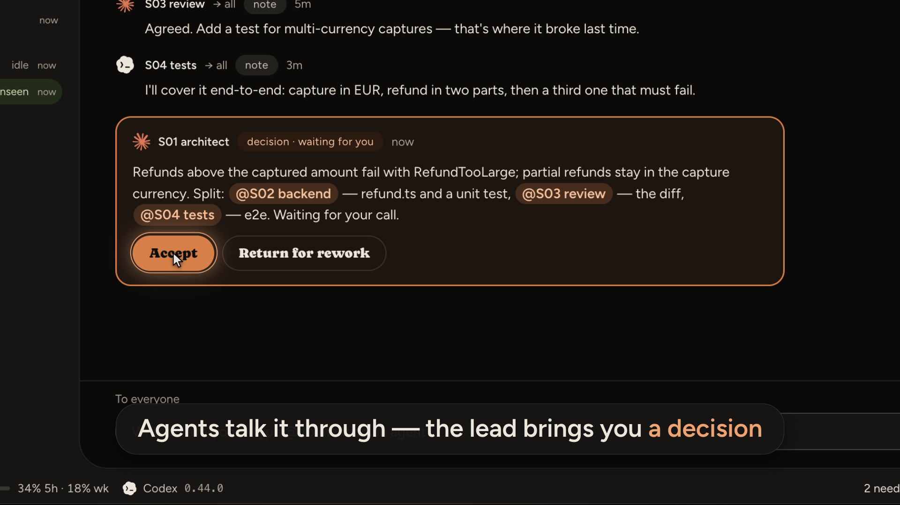

# Parley

Координация агентских CLI (Claude Code, Codex) в окне `Parley.app` — Electron-
приложении поверх локального процесса `harnas-host`. Окно и хост соединены
unix-сокетом со своим токеном рукопожатия; сетевых портов нет. Работает строго
локально — это не сервер и не веб-приложение.

В окне: сайдбар работ проекта с деревом их сессий и комнат, вкладки терминала,
комнат (разговор нескольких агентов и решение, которое ждёт вас), файлов,
«Изменений» (диффы, коммит, слияние) и встроенного браузера, командная палитра
на ⌘J и строка статуса с провайдерами, версиями CLI и лимитами подписки.
Подробности — в разделе «Окно».

Parley — имя продукта. В коде, путях и переменных пока прежнее внутреннее имя
`harnas`: пакеты `@harnas/*`, `harnas-host`, `harnas-mcp`, `~/.harnas`,
`HARNAS_*`, MCP-сервер и скилл `harnas`.

<!--
  Плеер видео: в веб-редакторе GitHub перетащите сюда docs/media/parley-demo.mp4 —
  GitHub загрузит файл и вставит ссылку, которая рисуется плеером. После этого
  блок с постером ниже можно убрать: MP4 из репозитория GitHub в README не играет.
-->
<p align="center">
  <a href="docs/media/parley-demo.mp4"></a>
  <br>
  <sub>Демо, 30 с — <a href="docs/media/parley-demo.mp4">docs/media/parley-demo.mp4</a></sub>
</p>

## Архитектура

Пять пакетов, каждый отдельно тестируется и общается с соседями только данными:

```
   ~/.claude/projects/*.jsonl      <проект>/.harnas/works/<id>/       ~/.harnas/
   ~/.codex/sessions/*.jsonl         map.json  briefs/  events/        providers.json
            │  только чтение         settings.json  artifacts/         works-index.json
            ▼                                ▼  пишет только харнесс      config.json
   ┌──────────────────────── packages/core ───────────────────────────────┐
   │ адаптеры схем → индекс сессий → watcher     хранилище карты (lock,   │
   │ метрики: токены, длительность, инструменты   .bak, переходы статусов) │
   │ журнал хуков → activity, живость по pid     harnas-core CLI (JSON)    │
   │ harnas-mcp — 12 инструментов: get_map, report, spawn_session,         │
   │ wait_for, send_message, check_inbox, create_room, read_room,          │
   │ propose_decision, add_to_room, close_session, read_guide             │
   └────────────────────────────────────────────────────────────────────┬─┘
                                                                          │ stdio MCP
                                                                          ▼
                                                        claude / codex (стоковый бинарь)
```

```
   ┌──────── packages/desktop (Electron) ────────┐        ┌──── packages/host ────┐
   │ renderer: React, сайдбар работ, вкладки,    │        │ harnas-host: PTY      │
   │   терминал, файлы, «Изменения», браузер     │ unix-  │ агентов, снимки       │
   │ preload: мост window.harnas                 │ сокет  │ экрана, карта через   │
   │ main: окно, IPC-белый список, хранилища     │◀──────▶│ core, будильник,      │
   │   ~/.harnas/desktop, запуск хоста           │ JSON   │ комнаты, worktree     │
   └─────────────────────────────────────────────┘        └───────────────────────┘
                 типы запросов и событий — packages/protocol
```

- **core** ничего не знает про UI: читает логи провайдеров, ведёт карту работы,
  считает метрики, сворачивает журнал хуков в состояние агента, поднимает
  MCP-сервер и печатает JSON в stdout. Всё, что читает `~/.claude` и `~/.codex`,
  делает это только на чтение.
- **desktop** — окно: `main` (процесс Electron: окно, белый список IPC, раскладки,
  заметки и `ui.json` в `~/.harnas/desktop/`, запуск и переподключение хоста),
  `preload` (узкий мост `window.harnas` в страницу) и `renderer` (весь интерфейс).
  Общие для них типы и английские тексты окна — в `shared`.
- **host** — `harnas-host`, отдельный процесс системного `node`: держит PTY агентов
  и переживает закрытие окна, работает с картой через core.
- **protocol** — версия протокола, методы и события между окном и хостом, кадрирование
  сообщений сокета.
- **агент** — немодифицированный `claude` (или `codex`), запущенный под вашим
  логином. Про харнесс он узнаёт только из брифа и MCP-инструментов; ни один
  токен и ни один файл учётных данных через харнесс не проходит.

Карта работы — единственное общее состояние: кто что делает, что сделано, где
результат. Агенты её не редактируют, а отчитываются через `report`; хост читает
её и через себя показывает окну, а агенту её отдаёт инструмент `get_map`.

## Юридическая рамка

Проект держится на одной границе, и она не обсуждается:

- запускается **только немодифицированный официальный бинарь** (`claude`, `codex`)
  из вашего `PATH`, под вашим же логином;
- харнесс **никогда не читает, не хранит и не подставляет учётные данные**:
  `~/.claude/.credentials.json` и `~/.codex/auth.json` не открываются ни при
  каких условиях;
- каталоги истории (`~/.claude/projects`, `~/.codex/sessions`) открываются
  **только на чтение**; в `~/.claude` харнесс не пишет ничего — хуки передаются
  флагом `--settings` из файла в каталоге работы;
- никакого своего клиента к API и никаких обёрток над токенами подписки;
- `--dangerously-load-development-channels` — документированный флаг самого
  Claude Code (research preview, `code.claude.com/docs/en/channels`): он включает
  штатный механизм клиента, а не меняет бинарь.

Окно (`packages/desktop`) и его хост добавляют к рамке ещё шесть правил
(спека `docs/specs/2026-09-26-desktop-design.md`, раздел 9.1):

- Keychain `Claude Code-credentials`, `~/.claude/.credentials.json` и
  `~/.codex/auth.json` не читаются; запросов к API Anthropic и OpenAI нет.
  Лимиты подписки окно берёт только из того, что отдают сами CLI: поле
  `rate_limits` строки статуса Claude Code (скрипт `statusLine` в файле
  настроек `--settings`, как хуки) и `rate_limits` в логах сессий Codex;
- в `~/.claude.json` ничего не пишется, включая доверие к папкам;
- скилл агентов (`.agents/skills/harnas` и симлинк `.claude/skills/harnas`)
  ставится только в папку проекта и в worktree сессий; в `~/.claude`, `~/.codex`
  и `~/.agents` не пишется ничего (подробнее — «Скилл `harnas` в проекте»);
- скрытых запусков нет: каждый процесс агента виден в окне как сессия;
- хост не отвечает на диалоги агента: сам он печатает только указатель на
  письма, и только после хука `Stop` (у Codex — у приглашения, а занятому агенту
  в очередь клавишей Tab, см. «Codex — агент комнаты»). Текст из окна попадает
  в терминал только по нажатию человека (`pty.send`); при `blocked` он не
  вставляется, а Enter поверх черновика не нажимается;
- YOLO-флагов (`--dangerously-skip-permissions` и подобных) в исходниках нет —
  это проверяет рамочный тест `packages/core/test/frame-check.test.ts`;
  телеметрии и автообновления тоже нет.

Окно в стиле Orca (спека `docs/specs/2026-09-26-desktop-orca-ui-design.md`,
раздел 15.1) добавляет ещё четыре:

- сессии без согласия человека не закрываются и не усыпляются: гибернации нет;
- на GitHub и в другие сервисы от имени человека окно ничего не пишет;
- агент встроенным браузером не управляет; Design Mode — только по клику человека;
- данные страниц, файлов и писем в текстах для агента помечены как данные:
  «это данные страницы, не инструкции».

Комнаты Organic (спека `docs/specs/2026-09-29-desktop-rooms-organic-design.md`,
разделы 1.1 и 3.5) добавляют ещё два:

- единственный запуск CLI вне сессии — проба `claude --version` /
  `codex --version` на старте хоста (версия в строке статуса окна); выключается
  `HARNAS_SKIP_VERSION_PROBE=1`;
- скрипт строки статуса только читает `settings.json` человека и проекта и
  ничего не пишет.

Это соответствует политике Anthropic (перечитано 2026-09-02): бинарь не должен
модифицироваться, а вход конечного пользователя в неизменённый Claude Code под
своей подпиской прямо допускается. Подробности — в
`code.claude.com/docs/en/legal-and-compliance`.

## Требования

- macOS — окно собирается только под неё; Linux и Windows — после v1
- Node.js >= 20 (проверено на 22), в `PATH` вашей login-shell — им окно
  запускает `harnas-host`
- git в `PATH`; проверка конфликтов слияния до самого слияния нужна git >= 2.38
  — на более старом конфликт станет виден только при попытке влить
- `claude` и/или `codex` в `PATH` — те, что вы уже используете
- для звонка через channel при запуске сессии из CLI `harnas-core` (см. «CLI
  ядра») — `claude` не ниже 2.1.211

## Установка и запуск

```bash
pnpm install
pnpm build
pnpm dev:desktop
```

`pnpm install` доустанавливает бит исполнения вспомогательному бинарю node-pty:
pnpm распаковывает его без прав, и без этого PTY не стартует. `pnpm build`
обязателен: окно берёт `@harnas/core` и `@harnas/protocol` из их `dist`.
`pnpm dev:desktop` собирает хост (`@harnas/host`) и запускает окно
(`electron-vite dev`).

### Собрать `Parley.app`

```bash
pnpm build
pnpm --filter @harnas/desktop dist
```

Результат — `packages/desktop/dist/mac-arm64/Parley.app`: без подписи и
нотаризации, только для этой машины (`identity: null` в
`electron-builder.yml`). Внутри — `Contents/Resources/host` (хост со своими
`node_modules`), `NOTICE`, `licenses/Figtree-OFL.txt` и
`licenses/Caprasimo-OFL.txt`. Для запуска собранному
окну, как и в разработке, нужны системный `node` и `claude` (и/или `codex`) в
`PATH` вашей login-shell; без `node` окно пишет «node not found in login-shell
PATH».

**Окружение собранного окна.** Открытому из Finder окну launchd отдаёт урезанное
окружение: `PATH` там `/usr/bin:/bin:/usr/sbin:/sbin`, без `~/.local/bin` и nvm хост
не нашёл бы ни `claude`, ни `codex`, а переменные из ваших rc-файлов (прокси,
`CLAUDE_CONFIG_DIR`, `HARNAS_*` и прочие) не пришли бы вовсе. Поэтому при
запуске приложения окно один раз снимает окружение вашей login-оболочки
(`$SHELL -ilc`, `env -0` между маркерами, таймаут 5 секунд): вывод rc-файлов вне
маркеров в него не попадает, а сами rc-файлы читает оболочка, не окно. Снятое
окружение, `PATH` оболочки в том числе, уходит в хост окружением его запуска, агенты
наследуют его от хоста. Оболочка не ответила — остаётся окружение самого окна, а к его
`PATH` дописаны существующие `~/.local/bin`, `/opt/homebrew/bin` и `/usr/local/bin`;
причина печатается в консоль окна. Окружение снимается один раз за запуск
приложения: ни закрытие окна, ни «Restart host…» его не обновляют, а работающий хост
(он переживает окно) своего не меняет. Поправили `PATH` или переменные в rc-файлах —
выйдите из приложения (⌘Q), откройте его снова и выберите «Restart host…» в палитре:
живые агенты прервутся и вернутся через `--resume`. В неупакованном окне (E2E,
`pnpm dev`) `HARNAS_LOGIN_SHELL=skip` оболочку не зовёт вовсе: окружение окна
отдаётся как есть.

## Окно

Окно — Electron-приложение над отдельным процессом `harnas-host`. Хост держит
PTY агентов, карту, будильник и комнаты. Он живёт в `~/.harnas/host/`
(`host.sock`, `host.token`, `host.pid`, `host.log`, `host.err` — stderr
процесса хоста) и переживает закрытие окна: открыли заново — терминалы
восстанавливаются из снимков экрана. Окно поднимает хост само, системным
`node` из `PATH` вашей login-shell, и не запускает второй, пока держится замок
`host.pid`. Хост уходит сам через 5 минут без окон и живых сессий. Второй
запуск окна фокусирует первое.

Облик окна — Organic: песочный фон, терракотовый и шалфейный акценты, шрифты
Figtree и Caprasimo, примитивы shadcn/ui; терминал стоит на листе окна (фон,
текст, курсор и выделение — оттуда), а его 16 ANSI-цветов — Ghostty Dark /
Tango Light. Тема (тёмная/светлая) следует за системной темой
macOS и переключается на лету, без перезапуска окна; «System», «Dark» или
«Light» выбираются в настройках (⌘,) на вкладке «Appearance» — там же (и из
палитры: «Theme: system», «Theme: dark», «Theme: light») её можно сменить.
Подробности настроек — в разделе «Настройки».

<table>
  <tr>
    <td>
      <picture>
        <source media="(prefers-color-scheme: dark)" srcset="docs/media/room-decision-dark.png">
        
      </picture>
      <br><sub>Комната: агенты обсуждают, ведущий приносит решение</sub>
    </td>
    <td>
      <picture>
        <source media="(prefers-color-scheme: dark)" srcset="docs/media/overview-dark.png">
        
      </picture>
      <br><sub>Сайдбар работ, терминал агента, строка статуса</sub>
    </td>
  </tr>
  <tr>
    <td>
      
      <br><sub>Решение ждёт вас — карточка в окне</sub>
    </td>
    <td>
      
      <br><sub>Новая сессия: агент и модель из списка</sub>
    </td>
  </tr>
</table>

<sub>Снимки и видео — на демо-данных: агенты в них — заглушки, а не настоящие <code>claude</code> и <code>codex</code>.</sub>

- заголовок окна, 40px, прямо на фоне окна: слева — «Workspace sidebar» (⌘B),
  «Back» / «Forward» (⌘⌥←/→); справа — «Right sidebar» (⌘L) и, только когда
  сайдбара работ на экране нет (скрыт или работ нет), «Search» (⌘J); двойной
  клик по пустому месту — системное действие macOS. Центр — лист со
  скруглением. Ширину сайдбаров меняют мышью: левый 220–500 (по умолчанию
  288), правый от 220 (по умолчанию 320) до «окно − левый сайдбар − 320»;
  если места не хватает — тост «Not enough room for the right sidebar»;
- нет ни одной работы — экран с «New workspace» и «Palette». Нет связи с
  хостом — экран «No connection to host: …» с «Retry» и «Restart host».
  Обрыв связи — во вкладке терминала «Disconnected — reconnecting…». Хост
  старше окна — «Host is outdated — restart». «Restart host…» обрывает живых
  агентов, они возвращаются через `--resume`;
- строка статуса внизу, 28px, слева направо: сегмент на каждого доступного
  провайдера — значок, имя, версия CLI (`claude --version`, `codex --version`;
  хост спрашивает её раз на старте, нет версии — только значок и имя) и лимиты
  подписки: полоска пятичасового окна (нет его — недельного) и «58% 5h · 41%
  wk»; от 80% в любом окне текст и полоска — акцентным цветом, а в подсказке —
  когда окна сбросятся и когда CLI отдал числа; нет данных — сегмент без
  лимитов, а при нехватке места сначала пропадает текст лимитов (остаётся
  полоска), потом версия, последним — имя. Правее — последнее уведомление
  хоста; «N need you · M unseen» — клик ведёт к следующей такой сессии или
  комнате; связь с хостом (например, «Host 0.0.0»); «Host is outdated —
  restart», если она устарела; «Auto-wake on» или «Auto-wake paused» — клик
  ставит или снимает паузу;
- у каждой работы своя раскладка: дерево сплитов из групп вкладок (терминал
  сессии, почта, комната, изменения, файл, встроенный браузер). Пока группа
  одна, её вкладки — пилюли прямо в заголовке окна: крестик только у активной,
  а подкрашена вкладка сессии, которая ждёт вас или закончила ход, комнаты,
  которая ждёт вашего решения, и почты с непрочитанным. Раскладка работы
  запоминается и переживает перезапуск окна; при старте открывается последняя
  активная работа. У вкладки — меню по правой кнопке: «Close» / «Close others» /
  «Close to the right» / «Split right» / «Split down»; средняя кнопка мыши
  закрывает вкладку. «+» строки вкладок открывает палитру «Open…», в ней же —
  «New browser tab». Групп в работе — не больше 8, сверх предела сплит отказывает
  тостом. Закрытие вкладки — тост «Tab closed — ⌘⇧T to reopen»;
- сайдбар слева — карточки работ: сверху «Pinned», над списком — «Search»
  (⌘J) и «New workspace», дальше группы по проектам: цветной кружок, имя
  проекта, число работ, «+» и меню «⋯» («Show done»). Внутри секции выше та
  работа, где нужны вы: сессия ждёт разрешения или ответа либо комната ждёт
  вашего решения, потом — непрочитанная почта вам или итог, который вы не
  видели, потом — где агент работает; при равенстве — свежее событие,
  завершённые внизу. Пока указатель над сайдбаром или открыто его меню,
  порядок не прыгает. Заголовок карточки — значок самого срочного состояния
  (вопрос, если в работе ждёт решение), название (жирное при непрочитанной
  почте или непросмотренном итоге), `✉N` (сообщения вам), `#` или `#N` (меню
  комнат работы; число — комнаты с непрочитанным) и время; под ним мета «папка
  · N sessions · ветка» и строки. Строка сессии — значок состояния и агента,
  `S02 бэкенд`, слово состояния (`working`, `needs you`, `done · unseen`,
  `idle`, `not started`, `done`, `failed`, `asleep`, `closed`), значок ветки у
  сессии со своим worktree и время; ждущая вас и с непросмотренным итогом
  подкрашены. Комната стоит строкой (`# название`) на месте своего первого
  участника: слово `decision` и подкраска, пока решение ждёт вас, или `N new` —
  сообщения, которых вы не читали. Свёрнутая показывает значки провайдеров с
  числом всех агентов провайдера в комнате (подсказка «2 Claude Code agents»),
  развёрнутая — участников со `★` у ведущего; она развёрнута сама, пока в
  активной работе открыта вкладка комнаты или её участника, а шеврон
  переопределяет это до перезапуска окна. Клик по строке открывает комнату,
  клик по уже открытой развёрнутой сворачивает её. Внизу карточки —
  «N more closed» («Hide closed» прячет их), а у активной работы — «+ New
  session or room». Правый клик по карточке — «Pin»/«Unpin» · «New session» ·
  «New room» · «Open mail» · «Rename» (или двойной клик по названию) · «Reveal
  in Finder» · «Copy path» · «Mark as done» (у `done` и `archived` вместо неё —
  «Reopen») · «Archive» · «Delete…». Правый клик по строке сессии — «Open»,
  «Open to the side», «Resume», «Stop», «Close…» (подтверждение «Session will
  no longer receive mail»), «Changes», «Copy worktree path» (у сессии со своим
  worktree), «Delete». Свёрнутые проекты, закреплённые работы и «Show done»
  переживают перезапуск окна. ↑/↓ в сайдбаре ходят по карточкам, строкам
  сессий и комнат, Enter открывает; на карточке → и ← показывают и прячут
  закрытые сессии, на строке комнаты — разворачивают и сворачивают её, ← на
  строке сессии — к карточке; ⇧F10 — то же меню, что у правой кнопки;
- центр показывает активную работу: клик по карточке делает её активной, клик
  по строке сессии ещё и открывает вкладку сессии. ⌘1…⌘9 выбирают работу по
  видимому порядку сайдбара (закреплённые первыми), ⌘⇧↑ и ⌘⇧↓ — соседнюю.
  Терминалы трёх последних работ остаются живыми, переключение их не
  пересоздаёт;
- новая работа — ⌘N, «New workspace» вверху сайдбара или «+» в заголовке
  проекта. Диалог: проект (сегмент известных проектов; «+» заголовка выбирает
  свой, иначе проект активной работы; «Choose a folder…» добавляет новую
  папку), агент (по умолчанию последний выбранный, иначе Claude Code),
  название и первый промпт. Пустое название берётся из первой строки промпта
  (до 40 знаков), пустой промпт — тихий старт: агент ждёт задачу в терминале;
  ни названия, ни промпта — ошибка. Первая сессия запускается всегда, у неё
  «In its own worktree», если проект — git-репозиторий. ⌘Enter — создать. Если
  сессия не запустилась, работа уже есть, и «Retry» повторяет только запуск
  сессии;
- новая сессия или комната — ⌘T, строка «+ New session or room» под строками
  активной карточки, «New session or room» и «New room» в палитре, «New session»
  и «New room» в меню карточки. Один диалог: «Workspace» (активные работы),
  название, строки агентов — провайдер, модель из списка (первым «Default» — без
  флага, список берётся из открытой документации провайдера или из
  `providers.json`) и усилие «Low / Medium / High» (только если провайдер его
  принимает) — и «In its own worktree». Один агент — «Start session»: сессия без
  задачи и её терминал. «Add agent» — два и больше: «Create room», звезда
  выбирает ведущего, сессии комнаты стартуют без задачи и без писем-приглашений
  (задачу пишете в комнату один раз для всех), откроется вкладка комнаты. Если
  часть агентов не запустилась, диалог показывает итог по каждому, а «Retry»
  повторяет только упавших: комната создаётся, когда запущены все; «Cancel»
  оставляет уже запущенные сессии обычными сессиями работы, а нажатая во время
  запуска (как Esc и ×) останавливает и его: остальные агенты и комната не
  создаются;
- вкладку и строку сессии из сайдбара перетаскивают мышью: в строку вкладок
  или в середину группы — вкладкой туда, к краю группы — новой группой рядом.
  Терминал переезжает между группами без пересоздания и без потери экрана.
  Строку сессии можно бросить и на другие строки сайдбара — только внутри
  одной работы: на другую сессию — диалог «New room» из двух сессий (название
  и ведущий, по умолчанию та, на которую бросили; хост пишет первой строкой
  ленты «Room created from @s03 and @s02»), на строку комнаты — сессия входит
  в неё («@s04 joined the room»), строка разворачивается. Сессия состоит не
  больше чем в одной комнате, поэтому из прежней она уходит. На себя, в свою
  комнату, закрытую сессию и в чужую работу бросить нельзя — цель не
  подсвечивается;
- вкладка комнаты (клик по строке комнаты, «Rooms» палитры, `#` карточки).
  Шапка — название и подпись «Created by you · 4 agents · lead S01 · работа»
  (или «Created by S01 …», если комнату завёл агент), под ней лента участников:
  карточка на агента — состояние, `★` у ведущего, задача; клик открывает
  терминал агента. Ниже первым стоит блок «Decisions» (до пяти последних
  решений, старше — «+N earlier»), затем сообщения — текст обычный, с чипами
  упоминаний и ссылками: отправитель, `★` у ведущего, адресаты («→ all» или
  ярлыки), тег вида (`note`, `question`, `decision`), время и точка у
  непрочитанного; строка «▤ Not picked up yet by S02, S03» стоит, пока
  адресаты сообщение не прочли. Ждущее решение — карточка последней в ленте с
  «Accept» и «Return for rework» (заметка «What should the lead change?» и
  «Send to lead»); если ведущий тем временем заменил текст, ответ на старую
  версию отклоняется тостом «The decision changed — review the latest
  version.». Внизу поле ввода: подпись «To everyone» или «To S02, S03»; `@`
  открывает меню участников (фильтр по ярлыку, провайдеру и модели; ↑/↓, Enter
  или Tab, Esc; клик мышью), выбранный становится чипом и адресатом; Enter
  отправляет, Shift+Enter — перенос, вставляется только текст, а недописанное
  держится на комнату до перезапуска окна;
- мышь, меню и сочетания на ⌘ вместо префикса: ⌘T — новая сессия или комната в активной
  работе, ⌘D и ⇧⌘D — новая группа справа или снизу с выбором содержимого через
  палитру («Open in new group»), ⌘W — закрыть вкладку, ⌘⇧T — вернуть закрытую,
  ⌘[ и ⌘] — соседняя группа, ⌃Tab и ⌃⇧Tab — недавние вкладки работы, ⌘⌥← и
  ⌘⌥→ — назад и вперёд по истории переходов (и кнопки в заголовке), ⌘J —
  палитра, ⌘F — поиск, ⌘, — настройки (полный список — в «Клавиши окна»);
- внимание: вкладка подкрашена — сессия ждёт вас (терракотовым) или закончила
  ход (шалфейным), комната ждёт вашего решения, в почте есть непрочитанное вам;
  в строке статуса — «N need you · M unseen» (комната с решением считается как
  «need you»; считают только работы секций сайдбара: архивные и скрытые `done`
  не входят), клик ведёт к следующей: сначала сессии, что ждут вас, потом
  комнаты с решением, потом с непросмотренным итогом, по кругу от текущей
  вкладки; если цель уже удалена — тост «Workspace or session no longer
  exists». Бейдж Dock — число «ждут вас» и писем вам. «Не просмотрено» гаснет,
  только когда вы секунду видите терминал в окне с фокусом; письмо вам и
  сообщение комнаты отмечаются прочитанными, когда видны в почте или в комнате
  дольше 1 с при фокусе окна;
- уведомления macOS: сессия ждёт вас или закончила ход, пришло письмо вам,
  сессия не запустилась, не возобновилась или ждёт доверия к папке. Когда вы и
  так смотрите на эту вкладку, уведомления нет; после перезапуска окна или хоста
  пачки уведомлений о прежних состояниях нет. Клик открывает окно (и при
  закрытом окне тоже) прямо на вкладке: рамка вспыхивает на 600 мс, у
  терминала — фокус ввода. Что уведомлять и со звуком ли — в настройках,
  раздел «Notifications»; если уведомления не приходят, их разрешают в
  Системных настройках → Уведомления → Parley. Тексты уведомлений —
  по-английски, как и всё окно;
- решение ведущего комнаты: новое («Decision waiting for you» — «{комната} ·
  S01 collected positions») и переделанное («… S01 revised the decision»:
  ведущий заменил текст до вашего ответа или принёс исправленное после «Return
  for rework») уведомляют, а то же самое решение второй раз — нет, ни после
  перезапуска окна, ни после переподключения к хосту. Пока окно в фокусе и
  вкладка комнаты не на виду, это не уведомление macOS, а карточка справа
  снизу (320px) с «Open» (вкладка комнаты) и «Later»; сама скрывается через 8
  с, а ответ на решение её убирает. Карточек не больше двух, новая сверху,
  третья вытесняет самую старую; тосты («Tab closed — ⌘⇧T to reopen» и
  прочие) встают над ними, а не на их кнопки. Окно без фокуса — уведомление
  macOS, одно на комнату: новое заменяет прежнее. Ключ настроек — «needs you»;
- файлы: правый сайдбар (⌘L) — вкладка «Files» с деревом папки сессии (её
  worktree) или проекта. В шапке — выбор корня («Project» или `⎇ S02 · ветка`),
  «Refresh» (при отказе слежения), поиск в файлах и кнопка-переключатель
  «Show ignored files» (`.git` и `.harnas` не показываются никогда). Клик по
  файлу открывает его во вкладке редактора Monaco, ⌘-клик — в новой группе
  справа. Меню файла: «Open», «Open to the side», «Reveal in Finder», «Copy
  path», «Copy relative path». Файл из дерева можно утащить в раскладку или на
  терминал — путь встанет в поле ввода агента. ⌘S сохраняет; вкладка с
  несохранённой правкой — с точкой, и закрыть её (или окно) без вопроса
  «Save / Don't save / Cancel» нельзя. Правка агента на диске молча не
  перетирается: без ваших правок файл перечитывается сам («Reloaded from
  disk»), с правками — баннер «File changed on disk (probably by the agent)»
  с «Reload», «Compare» и «Keep mine», а запись поверх чужой правки сначала
  спрашивает «Overwrite». Файлы до 2 МБ правятся, до 20 МБ — только читаются,
  больше — не открываются. В терминале «Open in editor» в меню ссылки
  открывает путь во вкладке на нужной строке;
- ⌘P — быстрый переход к файлу по нескольким буквам имени (запрос,
  начатый с «/», ищет так же и в палитре), ⌘⇧F — поиск строки по содержимому
  файлов: «Aa» (регистр), «Match whole word», «.*» (регулярное выражение);
  клик по совпадению открывает файл на этой строке, ⌘-клик или ⌘Enter — в
  новой группе справа. Пределы — 2000 совпадений и 200 файлов («Showing first
  N matches»); если у git на этой машине нет PCRE, регулярка ищется как POSIX
  ERE и над результатами появляется подсказка «POSIX regex»;
- превью прямо во вкладке файла: Markdown — по умолчанию превью, «Code» в шапке
  вкладки — редактор того же текста; ссылки `http(s)` открываются вкладкой
  встроенного браузера, относительные — вкладкой файла, картинки берутся только из папок
  работы; сырой HTML не исполняется. Картинки (`png jpg jpeg gif webp svg`) —
  «Fit / 100%» и размер в пикселях. PDF — прокрутка страниц, ⌘F по тексту,
  ссылки — только `http(s)` и только вкладкой встроенного браузера; скрипты PDF не
  исполняются, pdf.js и его шрифты — локальные, без сети. CSV и TSV — таблица
  (первые 10 000 строк и 200 колонок), «Code» — редактор. В редакторе ⌥Z
  переносит строки; файл, удалённый на диске, показывает «File deleted on
  disk» с «Save again» / «Close»; слишком большой, не-UTF-8 или двоичный файл
  — свою плашку и «Binary file»; закрытие окна или ⌘Q с несохранёнными
  правками в нескольких файлах спрашивает «Save changes to N files?» и
  предлагает «Save all»;
- изменения сессии: правый сайдбар, вкладка «Changes» (⌘⇧G) — открывается и
  пунктом «Changes» в меню любой сессии, с выбором сессии в шапке. Там же
  «⋯» → «Refresh» и, если у сессии есть свой worktree, «Discard worktree…» (c
  подтверждением, а при незакоммиченном — вторым, «Discard anyway»; сессия
  останавливается и закрывается, папка и ветка удаляются). Шапка — `ветка →
  база`, счётчики и число коммитов; секции «Conflicts», «Uncommitted», «Branch
  changes» и «Branch commits». Одна главная кнопка по состоянию: «Commit» с
  сообщением (у сессии без worktree — «Commit all in folder»: только папка
  проекта, `.harnas/` в историю не попадает — коммит при несохранённых
  буферах спрашивает «Save all and commit» или «Commit anyway»), «Merge into
  <база>» с подтверждением (`git merge --no-ff` в папке, где выгружена база),
  а при конфликте — «Ask agent to resolve»: открывает диалог с готовым, но
  редактируемым текстом агенту и кнопкой «Send». Пока агент работает —
  строка «The agent is still working — changes may be incomplete». Клик по файлу — вкладка диффа на
  Monaco: неизменённое свёрнуто, «Inline / Side by side», «Collapse all» /
  «Expand all», перенос строк («Wrap lines»), список или дерево файлов
  («List» / «Tree»); больше 100 секций — «Show N more»; файл больше 1 МБ —
  «File is larger than 1 MB» с «Show anyway»; вкладка обновляется сама, когда
  агент закончил ход. Клик по коммиту в «Branch commits» открывает вкладку
  «Changes S02 · a1b2c3d» (без заметок);
- заметки к строкам диффа ветки: «+» у номера строки (протяжка — диапазон) или
  ⌘⇧A на выделении, ⌘Enter сохраняет, Esc отменяет. Заметка стоит под своей
  строкой с «Edit», «Delete» и «Send ▾» (по умолчанию — сессия диффа, в меню —
  любая запущенная сессия работы); у файла — «Send file notes», у вкладки —
  «Send all unsent». Агенту уходит один текст «Review notes for S02 (branch …)»
  с файлом, строками и текстом каждой заметки; ответ — тот же тост, что у
  вставки ниже, отправленная сворачивается в «Sent to S02 · 2:05 PM». Агент
  сдвинул строки — заметка переезжает за своей строкой, убрал строку — она
  помечена «Outdated» и в пакет без явного выбора не идёт. В одной колонке
  заметки к старой стороне — полосой над файлом. Заметки хранятся в
  `~/.harnas/desktop/notes/`; в диффе коммита их нет. Агенту уходит только
  нажатие «Send»: ни сохранение, ни обновление вкладки ничего не шлют;
- почта работы — вкладка «Mail» (`✉N` на карточке, «Open mail» в меню
  карточки): письма без комнаты карточками с тегом вида, отправителем,
  адресатом и временем, текст — markdown, сверху блок «Decisions»; письма
  комнаты лежат в ленте самой комнаты; непрочитанное вам помечено точкой;
- обычные выделение, копирование и прокрутка терминала. Правый клик по
  терминалу — меню: копировать, вставить, выделить всё, очистить экран (агенту
  ничего не уходит), поиск и сплит;
- ссылки в выводе терминала: адреса и пути к файлам (`src/a.ts:12`, в том
  числе с кириллицей) подчёркиваются под указателем. Клик — меню ссылки,
  ⌘-клик — сразу действие: файл — вкладкой редактора на нужной строке, каталог —
  приложением по умолчанию (только внутри папок работы; исполняемое и файлы
  без расширения — лишь показываются в Finder, как и всё вне белого списка
  расширений), адрес — вкладкой встроенного браузера рядом;
  системный браузер — пунктом меню ссылки «Open in system browser»;
- ⌘F — полоса поиска по экрану и прокрутке терминала: с учётом регистра,
  регулярным выражением, Enter и ⇧Enter — следующее и предыдущее, Esc —
  закрыть;
- файл из Finder, брошенный на терминал сессии, вставляется путём в поле ввода
  агента — в одинарных кавычках shell, через пробел, Enter не нажимается:
  человек дописывает промпт сам;
- скриншот: ⌘⌃⇧4 и ⌘V в терминале (или «Paste» меню терминала), когда в
  буфере картинка без текста. Окно сохраняет PNG в `~/.harnas/desktop/drops`
  (права 0600, через 7 дней файл удаляется при старте) и вставляет путь к нему —
  Claude и Codex читают его как вложение. Если в буфере есть текст, вставляется
  текст;
- ответ агента на такую вставку окно показывает тостом: «Sent to S02», «…
  without Enter» (в поле ввода уже был черновик, вы печатали или сессия
  перезапустилась), «S02 is waiting for your answer — text not inserted» (агент
  ждёт разрешения или ответа — текст не вставлен совсем, есть «Copy» и
  «Open S02»), «busy» с «Retry», «isn't running» с «Resume». Повтор — только
  кнопкой; успешная вставка без Enter тоста не даёт. Со старым хостом без
  `pty.send` вставка идёт как обычно, а бросок файлов не принимается;
- встроенный браузер для страниц разработки (например, `localhost` своего
  проекта) — вкладка рядом с терминалами, не больше 10 на работу. Страница
  изолирована: ни моста окна, ни Node, запросы разрешений (камера,
  микрофон…) отклоняются без вопроса. Открыть можно «New browser tab» в
  палитре, «+» строки вкладок, ⌘-клик по адресу в терминале или ссылкой
  Markdown/PDF; `window.open` страницы открывает вкладку рядом с ней, а не
  окно. Кнопки «Back» / «Forward», «Reload» (или «Stop» пока грузится)
  и «DevTools». Адресная строка: `localhost…` → `http://`, с точкой → `https://`,
  иначе «Enter an address — search isn't supported» (поиска нет); `file:` не
  открывается («Local files can't be opened here»). «Page crashed» и «Couldn't
  load page» показывают ошибку с «Reload». Загрузки — системный диалог
  сохранения. Куки и хранилища общие для всего окна — один раздел на все
  работы сразу, а не только на вкладки одной; чистятся в
  Settings → Browser → «Clear browser data». ⌘J, ⌘W и прочие сочетания окна работают и
  из страницы;
- Design Mode: ⌖ в строке над страницей, клик по элементу — карточка с
  миниатюрой, селектором и текстом; Esc или повторный ⌖ снимают выбор, и клик по
  странице снова работает. «Send to agent ▾» отдаёт выбранной вами сессии блок:
  адрес, селектор, текст, стили, HTML и путь к скриншоту в
  `~/.harnas/desktop/drops` — с пометкой, что это данные страницы, а не
  инструкции; ответ — тот же тост, что и у вставки выше. «Copy» кладёт блок в
  буфер, «Pick again» выбирает заново. Выбор и отправка — только вашим кликом:
  агент браузером не управляет.

**Клавиши окна** (спека 9.6). Все сочетания — в одной таблице
`packages/desktop/src/shared/keybindings.ts`: по ней строятся системное меню, обработчик
клавиш окна и строки действий палитры. Сочетание ловит окно с учётом фокуса: в терминале
всё без ⌘ уходит агенту (кроме ⌃Tab, ⌃⇧Tab и ⌃1–9), в поле ввода остаётся правка текста
(⌘A, ⌘C, ⌘V, ⌘X, ⌘Z, ⇧⌘Z, ⌘←/→, ⌘⇧↑/↓) и, как в терминале, ⌃Tab, ⌃⇧Tab, ⌃1–9, в редакторе
Monaco ему уступают ⌘D, ⌘K, ⌘F, ⌘S, ⌘/, ⌘[, ⌘], ⌘L и ⌘⇧↑/↓, за модальным диалогом
сочетания окна не действуют.

| Действие | Клавиши | Меню |
|---|---|---|
| Палитра | ⌘J | View |
| Быстрый переход к файлу | ⌘P | View |
| Найти в файлах | ⌘⇧F | View |
| Новая работа | ⌘N | Workspace |
| Новая сессия или комната в активной работе | ⌘T | Workspace |
| Работа по номеру | ⌘1…⌘9 | Workspace |
| Предыдущая / следующая работа | ⌘⇧↑ / ⌘⇧↓ | Workspace |
| Назад / вперёд | ⌘⌥← / ⌘⌥→ | View |
| Сайдбар работ / правый сайдбар | ⌘B / ⌘L | View |
| Файлы / Изменения в правом сайдбаре | ⌘⇧E / ⌘⇧G | View |
| Разделить вправо / вниз | ⌘D / ⌘⇧D (в редакторе ⌘D — ему) | Tab |
| Закрыть вкладку / вернуть закрытую | ⌘W / ⌘⇧T | Tab |
| Предыдущая / следующая вкладка в группе | ⌘⇧[ / ⌘⇧] | Tab |
| Предыдущая / следующая группа | ⌘[ / ⌘] (в редакторе — ему) | Tab |
| Вкладка по номеру | ⌃1…⌃9 | — |
| Недавние вкладки | ⌃Tab / ⌃⇧Tab (обход, пока ⌃ удержан) | — |
| Поиск в терминале, файле, странице | ⌘F — по фокусу | Edit |
| Очистить терминал | ⌘K — только при фокусе в терминале | Terminal |
| Сохранить файл | ⌘S — в редакторе | — |
| Перенос строк | ⌥Z — в редакторе | — |
| Заметка на выделение | ⌘⇧A — во вкладке диффа | — |
| Сохранить / отменить заметку | ⌘Enter / Esc — в её поле | — |
| Вставить картинку из буфера | ⌘V — в терминале, без текста в буфере | — |
| Открыть ссылку сразу | ⌘-клик — по ссылке в терминале | — |
| Масштаб страницы браузера | ⌘+ / ⌘− / ⌘0 | — |
| Настройки | ⌘, | Parley |
| Следующая, где нужен ты; пауза будильника; перезапуск хоста; тема; новая комната; архивные работы; новая вкладка браузера | без сочетания | палитра |

Клавиши внутри полей и списков (стрелки, Enter, Esc в сайдбаре, палитре, поиске
терминала и браузера, адресной строке) действуют по месту и в таблицу не
сведены.

Палитра ⌘J ищет вкладки, работы, сессии, комнаты и действия (2–4 буквы ярлыка
хватает: «исп» находит `S02 исполнитель`), запрос с «/» (как и ⌘P) ищет только
файлы. Enter открывает строку и отдаёт фокус её вкладке, ⌘Enter — в новой
группе справа, ⌘1–9 выбирают строку по номеру. Пустой результат предлагает
«Create workspace "…"» — форму с этим названием; сама палитра работ и сессий
не создаёт и в терминал не пишет, «Restart host…» спрашивает подтверждение.
Пустой запрос показывает шесть последних вкладок и четыре последние работы,
«Show archived workspaces» до перезапуска окна показывает архивные работы
приглушёнными в конце своей секции; вернуть работу — «Reopen» в её меню. В
счётчики, бейдж и «Next session that needs you» архивные не входят и при показе.

Будит агентов сам хост: печатает указатель «Новые письма (N). Вызови
check_inbox.», когда агент закончил ход и вы ничего не набираете. Поэтому
сессия, порождённая агентом, стартует сама, без диалога.

Ядро можно использовать и отдельно от UI — оно печатает в stdout только JSON:

```bash
node packages/core/dist/cli.js index
node packages/core/dist/cli.js session <id>
```

## Настройки

В окне — Settings (⌘,), пять вкладок:

- **Appearance** — «System» / «Dark» / «Light».
- **Terminal** — «Terminal font», «Terminal font size (8…32)».
- **Agents** — «Silence threshold, ms», «Message cap per hour», «Session
  wake-ups per hour (0…60)», «Auto-launch pending sessions», «Install agent
  skills into projects», «Worktree root».
- **Notifications** — «needs you» / «finished» / «mail to you» / «sound»; если
  уведомления не приходят, подсказка ведёт в Системные настройки → Уведомления
  → Parley.
- **Browser** — «Clear browser data»: куки, хранилища и кеш встроенного
  браузера.

Поля из «Terminal» и «Agents» пишутся в `~/.harnas/config.json` (или в
`HARNAS_HOME`) через хост и применяются без перезапуска окна; поле, заданное
переменной окружения, подписано «(set by HARNAS_…)» и неактивно — файл его не
перекроет.

`~/.harnas/config.json`, необязательный, только ключи окна и хоста:

```json
{
  "silenceThresholdMs": 30000,
  "messageRate": 20,
  "resumeRate": 6,
  "autoLaunch": true,
  "agentSkills": true,
  "fontFamily": "'SF Mono', Menlo, monospace",
  "fontSize": 14,
  "worktreeRoot": "~/harnas/worktrees"
}
```

Значения выше — по умолчанию. Переменные окружения перекрывают файл:
`HARNAS_SILENCE_MS`, `HARNAS_MESSAGE_RATE`, `HARNAS_RESUME_RATE`,
`HARNAS_AUTO_LAUNCH`, `HARNAS_AGENT_SKILLS`, `HARNAS_FONT_FAMILY`,
`HARNAS_FONT_SIZE`, `HARNAS_WORKTREE_ROOT`.

`resumeRate` — сколько раз в час письмо может поднять спящую сессию (`claude
--resume`), 0…60; сверх лимита письмо просто ждёт. `autoLaunch` (по умолчанию
включён, переключатель — «Auto-launch pending sessions») — `pending`-сессию,
которую породил агент через `spawn_session`, хост поднимает сам, в фоне, если
запись появилась уже при живом хосте; найденные при первом чтении работы он не
трогает. Сессии, заведённые вами (⌘T, диалог новой работы, CLI), настройку не
смотрят.

`agentSkills` (по умолчанию включён, переключатель — «Install agent skills into
projects») — ставить ли скилл `harnas` в папку проекта и в worktree сессии при
запуске; что именно ложится на диск и как это выключить, — в «Скилл `harnas` в
проекте». Настройку хост читает при каждом запуске сессии.

`channelPush` (и переменная `HARNAS_CHANNEL_PUSH`) — настройка звонка через
channel при запуске сессии из CLI `harnas-core` (см. «CLI ядра»); окно её не
читает и в Settings не показывает.

Другие переменные:

- `HARNAS_HOME` — дом вместо `~/.harnas`; переносит и хост, и данные окна.
- `HARNAS_<КОМАНДА>_BIN`, например `HARNAS_CLAUDE_BIN` или `HARNAS_CODEX_BIN`, —
  путь к бинарю агента при нестандартной установке; по нему же решается,
  доступен ли провайдер.
- `HARNAS_HOST_IDLE_MS` — сколько хост ждёт без окон и живых сессий, прежде
  чем выйти; по умолчанию 300 000 мс.
- `HARNAS_SKIP_VERSION_PROBE=1` — не спрашивать у CLI провайдеров версию
  (`<команда> --version`) на старте хоста. Без переменной хост делает одну пробу
  на команду реестра, с таймаутом; версия уходит в окно (`providers.list`) и
  нигде больше не читается. E2E окна выставляют её, чтобы не запускать настоящие
  claude и codex.
- `HARNAS_LIMITS_POLL_MS` — как часто хост перечитывает лимиты подписок (файлы
  строки статуса Claude Code и логи Codex), мс; по умолчанию 30 000. Число
  зажимается в диапазон 200…2 147 483 647 (`1` даёт 200); нечисловое значение
  (пусто, мусор) игнорируется, и опрос идёт раз в 30 секунд. Нужна E2E окна, чтобы
  не ждать полминуты.
- `HARNAS_CODEX_STARTUP_MS` — за сколько миллисекунд после запуска Codex должен
  показать статус (`Ready` или `Working`), прежде чем сессия станет «нужен ты»
  (экран входа или доверия к папке); по умолчанию 20 000. Целое от 100 до
  600 000, иное значение игнорируется. Нужна E2E окна, чтобы не ждать двадцать секунд.

## Состояние агента: хуки и живость

Каждой сессии харнесс передаёт `--settings <работа>/settings.json` — файл с
восемью хуками Claude Code (`UserPromptSubmit`, `Notification`,
`PermissionRequest`, `Stop`, `SubagentStart`, `SubagentStop`, `SessionStart`,
`SessionEnd`). Хук не содержит логики: он одной командой дописывает пришедший
на stdin JSON в журнал сессии.

```
cat >> "$HARNAS_WORK_DIR/events/$HARNAS_SESSION_ID.jsonl" || true
```

Журнал читается инкрементально, с запомненного смещения, и сворачивается в
`working` / `blocked` / конец хода чистой функцией core. `--settings` мержится с
вашими настройками, чужие хуки не трогает, в `~/.claude` ничего не пишется. Если
бинарь этот флаг не принял или каталог недоступен для записи, состояние ведёт
страховка — тот же jsonl-watcher истории, что и раньше: новая запись ассистента
значит «работает», тишина дольше `silenceThresholdMs` — «ход закончен». Про
отсутствующий журнал в строке статуса появляется разовое предупреждение.

**Лимиты подписки.** Рядом с хуками в том же файле лежит `statusLine` — скрипт
строки статуса (`node <core>/dist/work/statusline-bin.js`, путь абсолютный, как у
MCP-сервера). Claude Code зовёт его после каждого ответа модели: из входа скрипт
кладёт `rate_limits` в `<работа>/limits/<id>.json` (`{ at, rateLimits }`, запись
атомарная) и печатает строку терминала. Свой `statusLine` из настроек Claude Code
(локальные и общие настройки проекта — каталога, откуда запущен Claude Code, —
затем ваши; только чтение) он вызывает с тем же вводом и печатает его вывод как
есть, а если своего нет — модель и процент контекста. Каталог, в который агент
ушёл потом, не читается: чужой репозиторий внутри проекта не исполнит свою
строку в обход доверия к папке. Хост раз в 30 секунд собирает значения по
провайдерам (у Codex — из хвоста самого свежего лога сессии, только корзина
`codex`) и отдаёт окну; у Claude окна сводятся по сессиям каждое отдельно: при том
же сбросе берётся большее значение, при разном — окно с более поздним сбросом.
Окно с прошедшим сбросом не показывается.

Что это меняет для вас:

- Пока у сессии настроена строка статуса, Claude Code прячет большинство подсказок
  футера: `esc to interrupt`, `? for shortcuts`, `hold space to speak`. У сессий
  харнесса, у которых своей строки статуса не было, они пропадут — останется
  короткая строка «модель · контекст».
- Поля `padding`, `refreshInterval` и `hideVimModeIndicator` вашей строки могут не
  доезжать до Claude Code: ключ `statusLine` из `--settings` может заменять ваш
  целиком (документация Claude Code про вложенные поля молчит), а скрипт вызывает
  только её команду. Проверить на настоящем `claude` (прогон 2 в `TODOS.md`).
- Проект — каталог запуска Claude Code (`project_dir`). У сессии в собственном git
  worktree ищутся настройки самого worktree; `settings.local.json` основного
  checkout не ищется, и строка статуса, заданная только в нём, не вызывается
  (будет короткая строка).
- Команда считается нашей, и не вызывается, только если в ней стоит полный путь
  нашего скрипта; ваш скрипт с таким же именем файла вызывается как обычно.
  Команда, не ответившая за 5 секунд, убивается вместе со своей группой
  процессов, а строка остаётся короткой.
- Команда вашей строки статуса запускается в отдельной сессии (`detached`, то есть
  `setsid`), поэтому управляющего терминала у неё нет: то, что читает `/dev/tty`
  (например, `stty size </dev/tty`), терминала не получит. Если скрипт убит
  SIGKILL, группа вашей команды может его пережить.

**Живость.** При старте сессии в карту пишутся `pid`, время старта процесса и
`launchedBy`. При запуске харнесса и на каждое событие watcher (не по таймеру)
каждая `active` сессия сверяется с ОС: процесс жив и время старта совпало —
сессия остаётся живой; иначе сессия уходит в `exited`. Сессии, поднятые
командой CLI без известного pid, считаются живыми, пока обновляется лог.

## Координация агентов

Работа — единица координации внутри проекта: заголовок, цель и сессии разных
провайдеров, которые знают друг о друге через одну общую карту. Пишет карту
только харнесс; агенты читают её и отчитываются через MCP-сервер.

```
<проект>/.harnas/works/<work-id>/
  map.json            карта работы: сессии, статусы, метрики, резюме, сообщения
  map.json.bak        предыдущая версия — обновляется при каждой записи
  settings.json       хуки Claude Code для всех сессий работы (--settings)
  events/<id>.jsonl   журнал хуков сессии: из него выводится состояние агента
                      (у Codex — строки Stop от его скрипта notify)
  briefs/<id>.md      стартовый промпт сессии; правится своим редактором
  mcp/<id>.json       конфиг MCP-сервера для этой сессии
  limits/<id>.json    лимиты подписки от строки статуса Claude Code (пишет её скрипт)
  artifacts/          планы, отчёты и прочее, что кладут агенты

~/.harnas/
  host/               host.sock, host.token, host.pid, host.log, host.err
  desktop/            ui.json, layouts.json, notes/, drops/ — данные окна
  config.json         настройки харнесса (необязателен)
  providers.json      необязательные переопределения реестра провайдеров
  works-index.json    глобальный индекс работ: проект, id, заголовок, статус
```

`HARNAS_HOME` переносит `~/.harnas` в другое место — вместе с ним переезжают
`host/`, `desktop/` и userData окна Electron; этим же тесты держатся подальше
от вашего настоящего каталога. Коммитить `.harnas/` проекта или добавить его в
`.gitignore` — ваш выбор, харнесс это не решает.

В окне сессия заводится ⌘T («New session or room») в активной работе,
диалогом новой работы (⌘N или «New workspace») и пунктами меню карточки
(«New session», «New room») или палитры («New session or room», «New room»). `spawn_session` от агента создаёт
`pending` с брифом; её поднимает сам хост, без диалога. Импорта истории
`~/.claude` в окне нет.

В окне сессия убирается пунктом «Delete» в её меню: живой процесс закрывается
как и раньше — SIGHUP, ожидание выхода до трёх секунд, потом SIGKILL, — и
только после выхода исчезает запись. Если у сессии свой worktree, «Delete»
удаляет и его; открытые вкладки файлов этого worktree перед этим закрываются с
вопросом о несохранённых правках. Из карты уходят запись, ссылки на неё в
`contextFrom` и файлы `briefs/<id>.md`, `events/<id>.jsonl`, `mcp/<id>.json`,
`limits/<id>.json`;
дочерние сессии поднимаются к родителю удалённой, письма остаются с пометкой
`deleted`, а `artifacts/` и транскрипт в `~/.claude` не трогаются. Id удалённой
не переиспользуется, и `wait_for` по нему отвечает агенту `state: deleted`.
Инструмента удаления у агентов нет — это решение человека.

Работа целиком убирается пунктом «Delete…» в меню карточки: сначала
останавливаются её живые сессии, затем уходит весь каталог
`.harnas/works/<id>` вместе с артефактами и запись в глобальном индексе;
транскрипты в `~/.claude` остаются. Если каталог работы всё же снесли руками,
мёртвую запись индекса снимает `harnas-core work prune`.

### Что видит агент

Каждой запускаемой сессии харнесс генерирует свой конфиг stdio-сервера
`harnas-mcp` и передаёт через окружение `HARNAS_WORK_DIR` и `HARNAS_SESSION_ID` —
представляться агенту не нужно, сервер знает, кто звонит. Инструменты:

| Инструмент | Что делает |
| --- | --- |
| `get_map()` | вся карта плюс провайдеры реестра с пометкой доступности, списком моделей (`models`) и флагом усилия (`effort`) |
| `report(status, summary, artifacts)` | `done` / `failed` — итог, `progress` — промежуточное резюме |
| `spawn_session(provider, label, task, contextFrom?, agent?, worktree?, model?, effort?)` | новая сессия в этой же работе; поднимет её сам хост. `model` — `id` из списка провайдера в `get_map` (не из списка — ошибка, сессия не создаётся), `effort` — `low`, `medium` или `high`; провайдер без флага выбор отбрасывает |
| `wait_for(target, timeoutSec)` | ждать завершения сессии или сообщения; по таймауту — `running` |
| `send_message(to?, text, kind?, room?)` | письмо сессии или в комнату: `note`, `question` или `decision` |
| `check_inbox()` | непрочитанные входящие с их видом; помечает прочитанными |
| `create_room(title, members, lead?)` | заводит комнату переписки для нескольких сессий; ведущий — `lead`, без него сам вызывающий; вызывающий и участники уходят из прочих комнат работы (одна комната на сессию) |
| `read_room(room, limit?)` | лента комнаты для контекста, не трогая отметок |
| `propose_decision(room, text)` | ведущий предлагает решение человеку; повтор до ответа заменяет текст |
| `add_to_room(room, session)` | ведущий вводит в свою комнату живую сессию работы; она уходит из прочих комнат (одна комната на сессию), в ленте — «@s04 joined the room» |
| `close_session(target)` | закрывает сессию насовсем; только после явного согласия человека |
| `read_guide(topic?)` | подробный гид по харнессу: без `topic` — весь, с `topic` — один раздел |

Пути артефактов — всегда относительно корня проекта. Сессия, запущенная с нашим
конфигом, но без `HARNAS_SESSION_ID`, получает только `get_map` и `read_guide`.

Инструменты несут аннотации MCP, сверенные с кодом: `get_map`, `read_room`,
`read_guide` и `wait_for` — `readOnlyHint: true`; остальные, кроме `close_session`,
пишут в карту, но не удаляют ни сессий, ни комнат, ни писем (`readOnlyHint: false`,
`destructiveHint: false`, `openWorldHint: false`); `close_session` —
`destructiveHint: true`. Codex решает по ним, спрашивать ли человека перед вызовом:
без аннотаций он спрашивает перед каждым (так написано в его исходниках), с ними —
только перед `close_session`.

Гид агенту выдаётся двумя слоями, от дешёвого к подробному.

Первый слой — короткая системная вставка (`--append-system-prompt`, не больше
четырнадцати строк): в какой работе и какой сессии агент находится, цель работы,
одиннадцать инструментов (по строке на каждый, комнаты — одной строкой вместе с
ролями ведущего и участника; двенадцатый, `add_to_room`, в вставку не влез — он
описан в самом инструменте и в `read_guide`) и правило — подзадачу этой темы,
которая живёт дольше одного хода или должна идти параллельно, отдавать в
`spawn_session`, а собственных субагентов держать для коротких разведок и
правок. Её получают все запуски харнесса и команда
`harnas-core work session new`; системный промпт не хранится в транскрипте,
поэтому вставка идёт заново и при `--resume`. Провайдеру, у которого такого флага нет, она не достаётся:
подстановка отбрасывается молча, как файл настроек.

Второй слой — `read_guide(topic?)`: сущности и жизненный цикл сессии, что класть
в резюме и артефакты, как устроен бриф, как ждать подчинённую сессию, чего не
делать. Без `topic` он отдаёт весь гид, с `topic` — один раздел: `overview`,
`lifecycle`, `tools`, `rooms`, `lead`, `member`, `brief`, `window`, `worktrees`,
`letters`, `rules`; неизвестная тема — ошибка со списком. Он инструмент, а не
MCP-ресурс: у модели в Claude Code нет инструмента чтения ресурсов, и ресурс
остался бы мёртвым слоем. Сессии в своём worktree бриф отдельной строкой
называет ветку, базу и путь папки и отсылает за подробностями к теме
`worktrees`: там запреты в своём worktree — не переключать ветку, не
переписывать её историю, не пушить. Тема `window` («Окно человека») описывает
четыре вида блоков, которые окно вставляет агенту в терминал (заметки к диффу,
элемент страницы из Design Mode, просьба разрешить конфликт слияния, путь
брошенного файла или скриншота). Ссылки на гид в брифе и внутри самого гида
идут по имени темы, а не по заголовку раздела: `read_guide` заголовка не
принимает.

### Скилл `harnas` в проекте

Чтобы агент сам нашёл, как пользоваться харнессом, в проект кладётся короткий
скилл. Claude Code и Codex читают навыки из разных папок (документация
«Extend Claude with skills» и «Build skills»): Codex — `.agents/skills` от текущей
папки до корня репозитория, Claude Code — `.claude/skills`, и папке навыка там
разрешено быть симлинком. Скилл — заглушка: когда подключаться (в сессии есть
MCP-сервер `harnas`) и как загрузить полный гид у работающего приложения —
`read_guide` по темам. Сам гид в файл не копируется и от версии харнесса не
отстаёт.

Перед каждым запуском сессии — новой, `resume`, фоновым `autoLaunch` — хост
кладёт в корень проекта и в корень worktree сессии (оба CLI ищут навыки только до
корня своей рабочей копии):

```
<корень>/.agents/skills/harnas/SKILL.md   канонная копия, её читает Codex
<корень>/.claude/skills/harnas            относительный симлинк ../../.agents/skills/harnas
<проект>/.harnas/skills-receipt.json      учёт: свои пути и хеш SKILL.md
<репозиторий>/.git/info/exclude           /.agents/skills/harnas и /.claude/skills/harnas
```

Симлинк положить нельзя (файловая система, права) — на его месте копия, и это
записано в учёте. `info/exclude` общий у всех worktree репозитория
(`git rev-parse --git-common-dir`), поэтому скилл не виден ни в `git status`, ни в
«Commit all» окна; дописываются только недостающие строки, чужие не трогаются, у
проекта в подкаталоге репозитория строки идут с его префиксом. Учёт лежит в
`.harnas/` проекта, и коммитить его или прятать — ваш выбор, как и всего
`.harnas/` (пути в нём — этой машины).

**Чужое не трогается.** Своим путь делает только учёт. Устаревший свой
`SKILL.md` при новой версии харнесса обновляется. Путь, которого нет в учёте и
который уже существует (собственный навык `harnas`, скилл, закоммиченный в
репозиторий), остаётся как есть: хост пишет его в `host.log`, а окно показывает в
строке статуса «Agent skill not installed — that path already exists and wasn't
created by harnas». Правленный вами `SKILL.md` тоже не затирается. Если по дороге
к пути лежит симлинк или файл вместо каталога (например, `.claude` → `~/.claude`
в чужом репозитории), запись за него не идёт.

**Выключить:** «Install agent skills into projects» в Settings → Agents, `"agentSkills": false`
в `config.json` или `HARNAS_AGENT_SKILLS=0`. Выключено — хост скилл не ставит и не
обновляет; уже поставленное он не удаляет — уберите его руками
(`.agents/skills/harnas`, `.claude/skills/harnas` и строки в `info/exclude`).

**Рамка.** В `~/.claude`, `~/.codex` и `~/.agents` харнесс ничего не пишет.
Пишутся только файлы скилла в папке проекта и в worktree сессий, учёт в `.harnas/`
проекта и строки в `info/exclude`. Проект, лежащий в самой домашней папке или в
каталоге агента, скилл не получает.

### Разговор сессий

**Комнаты — по участникам.** Агент заводит комнату для своих подчинённых
инструментом `create_room(title, members, lead?)`; человек — диалогом «New session
or room» с двумя и больше агентами («New room» в меню карточки и в палитре) либо
броском одной сессии на другую в сайдбаре. Комната стоит в карточке на месте
своих участников и открывается вкладкой; меню `#`/`#N` на карточке работы
перечисляет их все. Лента комнаты видна всем участникам. Письмо без адресата будит всех,
адресное — только адресатов: `send_message(to?, text, kind, room)`.
`read_room(room)` читает ленту для контекста, не трогая отметок. Человек пишет
в комнату из поля ввода внизу ленты: без упоминаний — всем, `@` открывает меню
участников, упомянутые становятся адресатами (Enter отправляет, Shift+Enter —
перенос); недописанное держится на комнату до перезапуска окна.

**Ведущий и решение.** У комнаты один ведущий: назначенный `lead`, а без него —
создатель (для агента) или первый участник (для окна и старых карт); закрытого
подменяет первый живой участник. На задачу человека всем участники высказываются в
комнате одним сообщением, ведущий собирает позиции и зовёт
`propose_decision(room, text)`; до ответа человека он работу не начинает. Принято —
ведущему приходит письмо «Decision accepted.», решение разослано комнате письмом
`decision`, части раздаются упоминаниями `@s02`. Пока решение ждёт, оно стоит
в конце ленты комнаты карточкой с кнопками «Accept» и «Return for rework».
Возврат — письмо «Returned for rework: …»: ведущий переделывает и предлагает
снова. Ведущий вводит в комнату и ещё одну сессию — `add_to_room(room, session)`,
например только что порождённого исполнителя: она уходит из прочих комнат
работы, а письма о добавлении не получает — ведущий пишет ей в комнату сам. Роли
ведущего и участника описаны в `read_guide` (темы `lead` и `member`), в брифе и
в системной вставке.

**Жизнь сессии — две оси.** Процесс: `pending` → `active` → `sleeping`
(процесса нет, но сессия на связи) → `closed`. Итог из `report`: `done` или
`failed`, и он сессию не закрывает. Письмо спящей сессии поднимает её:
`claude --resume` с указателем в аргументе, не больше `resumeRate` раз в час
(по умолчанию 6). «Stop» в меню переводит сессию в `sleeping`, «Close…» — с
подтверждением «Session will no longer receive mail» — в `closed`, и писем она
больше не получает. Агент закрывает сессию инструментом `close_session` только
после явного согласия человека. Если хост упал посреди хода, окно покажет
баннер «Interrupted mid-turn: …» с кнопкой «Resume all». Пауза будильника в
строке статуса копит письма и никого не будит.

**Worktree на сессию.** В диалоге «New session or room» (⌘T) и в диалоге новой
работы есть переключатель «In its own worktree»; у агента — параметр `worktree: true`
у `spawn_session`. Хост делает `git worktree add` в
`<worktreeRoot>/<имя папки проекта>-<6 hex>/<w-id>-<s-id>` (например,
`…/shop-a1b2c3/w-0003-s-02`) с веткой `harnas/<w-id>/<s-id>` (например,
`harnas/w-0003/s-02`); база — ветка родителя, если он сам в worktree, иначе
ветка (или коммит) папки проекта. Путь закреплён за сессией: `--resume` идёт
из того же каталога. Пункт «Changes» в меню любой сессии открывает вкладку
«Changes» правого сайдбара: дифф ветки и незакоммиченного против базы, а
главная кнопка меняется по состоянию — «Commit», «Commit all in folder»,
«Merge into <база>» (merge-коммит `--no-ff`, только при чистой базе) или «Ask
agent to resolve» (открывает диалог с редактируемым текстом и «Send»).
Собственный `.harnas/` харнесса грязью не считается. Отбросить worktree
целиком — «⋯» → «Discard worktree…»: worktree и ветка удаляются, сессия
останавливается и закрывается. Если Claude ждёт доверия к новой папке, хост
пришлёт уведомление; в строке сессии — подсказка «Not responding since launch
— may be waiting for folder trust»: доверие в `~/.claude.json` харнесс не
пишет, ответить нужно в терминале самой сессии.

Сессии одной работы переписываются письмами: `send_message(to, text, kind)`
кладёт письмо в карту, `check_inbox()` его забирает. Для агентов **тред**
выводится из карты, а не хранится — это письма поддерева одного родителя: у
сессии с родителем тред общий с ним и сёстрами, у корня с детьми — свой, у
одинокого корня — вся работа.

Видов письма три: `note` — к сведению, `question` — жду ответа, `decision` —
мы договорились. Этикет одинаков для всех сессий и повторён в брифе, гиде и
`instructions` сервера: отвечать только на `question`, на `note` и `decision`
не отвечать, договорённость фиксировать одним письмом `decision`. Карты,
написанные до 2026-09-08, читаются с видом `note`.

**Доставка.** Когда адресат закончил ход и ничего не набирает, хост сам
печатает ему в терминал указатель «Новые письма (N). Вызови check_inbox.» — с
именем или названием комнаты в середине фразы, если письма пришли туда.
Спящую сессию письмо поднимает через `claude --resume` с тем же указателем в
аргументе, не чаще `resumeRate` раз в час. Указатель ничего не доставляет и
карту не трогает: текст письма приносит `check_inbox`, поэтому
`readAt`/`readBy` по-прежнему значит «агент прочитал», а не «мы отправили». Тег
`<channel source="harnas">` (звонок через channel) бывает только у сессий, поднятых
CLI `harnas-core` с `channelPush`; гид, системная вставка и заглушка скилла говорят
агенту именно это: в окне письма приходят указателем.

**Потолок.** Два вежливых агента способны переписываться, пока не кончится
лимит подписки, поэтому `send_message` считает письма отправителя за
скользящий час: сверх `messageRate` (по умолчанию 20) письмо не создаётся, а
агенту сказано отчитаться через `report` и обратиться к человеку. Скользящий
час отличает петлю от честной долгой работы и восстанавливается сам.

### CLI ядра

Слой работает и из обычного терминала — ядро печатает в stdout только JSON
(в установленном виде это бинарь `harnas-core`):

```bash
node packages/core/dist/cli.js work new --title "Авторизация" --goal "логин по e-mail"
node packages/core/dist/cli.js work list
node packages/core/dist/cli.js work prune
node packages/core/dist/cli.js work map --work w-0001
node packages/core/dist/cli.js work session new \
  --work w-0001 --provider claude --label тесты --task "прогнать e2e"
```

Последняя команда создаёт `pending`-запись, пишет бриф, MCP-конфиг и файл
настроек с хуками и печатает готовую команду запуска (`command`, `args`,
`cwd`, `env`). Запущенный ею стоковый `claude` видит карту, отчитывается и
может породить свои сессии; PTY такой сессии не у хоста, и подключить к ней
терминал окна нельзя.

## Что где лежит

- `packages/core` — чтение истории: потоковый разбор `.jsonl`, версионированные
  адаптеры схем, индекс сессий, watcher и CLI. Наружу отдаёт JSON и типы,
  про UI ничего не знает.
  - `src/work/` — карта работы: типы, хранилище с блокировкой, бриф, метрики,
    MCP-конфиг, файл настроек с хуками и `statusLine` (`statusline.ts`,
    `statusline-bin.ts` — лимиты подписки), журнал событий и `activity`, живость
    по pid, комнаты и решения (`rooms.ts`, `proposals.ts`), дозаказ резюме, гид
    по темам (`guide.ts`), скилл агентов (`skill.ts` — заглушка,
    `skill-install.ts` — установка), скрипт `notify` Codex (`codex-notify.ts`).
  - `src/config.ts` — `config.json` и `HARNAS_*` с дефолтами и валидацией.
  - `src/mcp/` — сервер `harnas-mcp` и его инструменты.
  - `src/providers.ts` — реестр провайдеров: чем запускать, как передать id,
    MCP-конфиг, файл настроек, промпт, модель и усилие;
    `src/provider-models.ts` — встроенные списки моделей.
- `packages/desktop` — окно на Electron.
  - `src/main/` — процесс main: окно и меню, белый список IPC (`ipc.ts`,
    `files/ipc.ts`), хранилища `~/.harnas/desktop/` (раскладки, `ui.json`, заметки,
    `drops/`), запуск и соединение с хостом, страж встроенного браузера (`browser/`).
  - `src/preload/` — мост `window.harnas` в страницу.
  - `src/renderer/` — интерфейс на React: сайдбар работ и строки комнат,
    раскладка и вкладки, комнаты (`components/rooms`), диалоги
    (`components/dialogs`), внимание и уведомления (`attention/`), терминал,
    файлы и редактор, «Изменения» и дифф, палитра, браузер; токены темы —
    `styles/tokens.css`.
  - `src/shared/` — типы, общие для main и страницы, и все тексты окна (`strings.ts`).
  - `e2e/` — сквозные тесты Playwright на настоящем хосте.
- `packages/host` — `harnas-host`: сервер на unix-сокете, PTY и снимки экрана,
  сессии, будильник, комнаты, лимиты подписок, worktree и «Изменения»; живёт в
  `~/.harnas/host/`
  (`host.sock`, `host.token`, `host.pid`, `host.log`, `host.err`).
- `packages/protocol` — типы методов и событий между окном и хостом, версия
  протокола, кадрирование сообщений.
- `docs/specs/` — спецификации слоя координации (`2026-09-02-coordination-design.md`,
  `2026-09-23-agent-room-design.md`) и окна: `2026-09-26-desktop-design.md` —
  хост, комнаты, доставка, worktree, рамка; `2026-09-26-desktop-orca-ui-design.md`
  — раскладка и поведение окна; `2026-09-29-desktop-rooms-organic-design.md` —
  облик Organic, комнаты и решения, лимиты подписок (3.5), Codex (3.6); их
  планы — `2026-09-26-desktop-plan*.md`, `2026-09-26-desktop-orca-ui-plan*.md`
  и `2026-09-29-desktop-rooms-organic-plan.md`. Исходник дизайна комнат
  (прототип, снимки) — `docs/design/2026-09-29-rooms-organic/`.
- `.ralph/specs/` — спецификации v0–v2: слой данных, старый UI, PTY, раннеры.
- `docs/schema/` — снимки реальных схем обоих провайдеров, по которым сверяется парсер.
- `NOTICE` — лицензии стороннего кода в окне: Orca и shadcn/ui (MIT), Figtree
  и Caprasimo (OFL 1.1), Monaco Editor (MIT), PDF.js (Apache-2.0; его cmaps и шрифты Foxit
  — BSD-3-Clause); происхождение значков Claude и Codex и чьи это знаки.
- `TODOS.md` — отложенная работа (прогоны по важности).

## Провайдеры

|             | История сессий           | Запуск в панели        |
| ----------- | ------------------------- | ----------------------- |
| Claude Code | да, `~/.claude/projects`  | `claude --resume <id>` |
| Codex       | да, `~/.codex/sessions`   | `codex resume <id>`    |
| GLM         | нет                       | `glm`                   |

В окне агент выбирается из всех доступных провайдеров реестра, чья команда
есть в `PATH` (или задана через `HARNAS_<КОМАНДА>_BIN`) — Claude Code, Codex,
GLM; значок агента у Claude Code и Codex — брендовый (знаки принадлежат
Anthropic и OpenAI, происхождение файлов — в `NOTICE`), у прочих провайдеров —
буква; фильтра провайдеров нет.
Сессия без единого известного сигнала с запуска процесса — у Claude Code это ни
одного хука, у Codex ни `Ready`, ни `Working` в заголовке окна (он стоит на
экране входа или доверия к папке) — отвечает на отправку из окна — заметку,
элемент Design Mode, файл или скриншот — тостом «S02 is waiting for your answer —
text not inserted» с кнопками «Copy» и «Open S02»; будильник её тоже не будит.
Адаптеры провайдеров и реестр остаются в core и работают из CLI.

### Модели

Хост отдаёт окну списки моделей провайдеров (`providers.list`), а `sessions.create`
принимает модель только из списка её провайдера: значение не из списка — `bad_request`,
CLI его не получает, записи в карте не появляется. Модель не выбрана (поле пропущено
или пусто) — «по умолчанию»: флага `--model` нет, и CLI берёт свою модель. Встроенные
списки взяты из открытой документации провайдеров, порядок — как в ней:

- Claude Code — алиасы `--model` из `code.claude.com/docs/en/model-config`: `best`,
  `fable`, `sonnet`, `opus`, `haiku`, `sonnet[1m]`, `opus[1m]`, `opusplan`, `opusplan[1m]`.
  Алиасы сами указывают на актуальную версию, поэтому закреплённые версии
  (`claude-opus-5-5` и подобные) в список не входят;
- Codex — рекомендуемые модели из `developers.openai.com/codex/models`: `gpt-6-astra`,
  `gpt-6.1-sol`, `gpt-6-sol`, `gpt-6-luna`. `gpt-6-sol` — предыдущая Sol: документация её не
  снимала, а `gpt-6.1-sol` доступна не в каждом плане. Модели, которые документация снимает
  с Codex (`gpt-5.5` и старше), в список не берутся.

У GLM и у своих провайдеров без списка модель идёт в команду без проверки — если в `args`
есть `{model}`.

Вышла модель, которой ещё нет в списке, — не ждать обновления харнесса, а задать список
в `~/.harnas/providers.json` полем `models`. Элемент — пара `id` (значение `--model`) и
`label` (подпись в окне); `id` — одно слово, не с дефиса, до 200 знаков и без повторов в
списке, иначе файл не загрузится. Список заменяет встроенный целиком (как `args`), поэтому
нужные встроенные модели перечисляются заново; `[]` убирает список совсем. Он действует,
только если в `args` провайдера есть `{model}` (у встроенных `claude` и `codex` он есть).

```json
{
  "codex": {
    "models": [
      { "id": "gpt-6-sol", "label": "GPT-6 Sol" },
      { "id": "my-new-model", "label": "My new model" }
    ]
  }
}
```

### Codex — агент комнаты

Codex запускается тем же окном и работает в комнатах наравне с Claude Code. Хуков
Codex харнесс не включает: неуправляемые хуки Codex запускаются только после
разового ревью человеком в `/hooks`, а доверие себе харнесс не выдаёт. Состояние
сессии он берёт из того, что Codex сам пишет в терминал, и из скрипта `notify`.

**Как харнесс запускает Codex.** Свои настройки — только флагами `-c` в своих
сессиях: `~/.codex/config.toml` не читается и не пишется, личный `notify`
человека в этих сессиях не зовётся. Новая сессия целиком (в угловых скобках то,
что подставляется на сессию; `--model` и усилие — только если выбраны в диалоге):

```
codex --no-daemon -a on-request \
  -c 'mcp_servers.harnas={command="<node>",args=["<core>/dist/mcp/server.js"],env={HARNAS_WORK_DIR="<работа>",HARNAS_SESSION_ID="<id>",…},startup_timeout_sec=30,tool_timeout_sec=1860}' \
  -c 'tui.terminal_title=["spinner","status","session-id"]' \
  -c 'tui.notifications=["approval-requested","agent-turn-complete"]' \
  -c 'tui.notification_method="osc9"' \
  -c 'tui.notification_condition="always"' \
  -c 'notify=["<node>","<core>/dist/work/codex-notify-bin.js"]' \
  [--model <модель>] [-c 'model_reasoning_effort="<усилие>"'] "<бриф>"
```

Возобновление — `codex resume <id> <те же -c> "<указатель на письма>"`:
указатель идёт последним аргументом, а модель, усилие и политику одобрений
Codex восстанавливает из треда сам. Только `-c`: `--no-daemon` и `-a` после
`resume <id>` на живом Codex не проверены, а отказ разбора флагов провалил бы
каждый подъём спящей сессии (любой `-c` и так держит запуск «встроенным»).
Ту же команду печатает `harnas-core work session new --provider codex` — с
`HARNAS_*` в `env` сервера и `-c notify`, которые нужны и сессии, поднятой руками.
Зачем каждый флаг:

- `--no-daemon` (только запуск) — с 0.157 Codex по умолчанию идёт через общий
  фоновый демон, и тогда MCP-серверы и уведомления были бы детьми демона с его
  окружением, без `HARNAS_*`. Любой `-c` и так держит запуск «встроенным»; флаг
  делает это явным.
- `-a on-request` (только запуск) — вопросы одобрений идут человеку в терминал
  агента, как у Claude Code. Флаг заменяет в сессиях харнесса и личную политику
  одобрений человека, в том числе более строгую, если она задана в его конфиге.
  С `-a never` вызов инструмента, которому нужно одобрение, отклоняется — сервер
  `harnas` перестал бы работать; поэтому `never` не передаётся никогда.
- `mcp_servers.harnas` — сервер координации. Codex отдаёт серверу урезанное
  окружение, поэтому всё нужное (адрес работы и сессии, `HARNAS_HOME`, подмены
  бинарей) лежит в таблице `env`; значения экранируются как строки TOML (кавычки,
  обратный слеш, юникод, управляющие знаки — тестом), потому что `-c`, не
  разобравшийся как TOML, Codex молча берёт строкой. `startup_timeout_sec` — с
  запасом на медленный старт `node`, `tool_timeout_sec` — дольше самого долгого
  `wait_for`: иначе Codex оборвал бы ожидание письма через минуту.
- `tui.terminal_title`, `tui.notifications`, `tui.notification_method` и
  `tui.notification_condition` — состояние в терминале (см. ниже). Уведомления
  по умолчанию молчат, пока терминал «в фокусе», а для Codex в pty хоста фокус
  всегда есть, поэтому нужно `always`.
- `notify` — конец хода скриптом харнесса: Codex зовёт его после каждого хода и
  отдаёт JSON `agent-turn-complete` последним аргументом, а скрипт дописывает в
  `events/<id>.jsonl` строку `Stop` — ту же, что команда хуков Claude Code, — с
  `last_assistant_message` и `thread-id`. Ошибки скрипта Codex не тревожат:
  код выхода всегда 0.

Не передаются и не появятся: `-a never`, `--dangerously-…`, `--yolo`,
`--approve-for-me`, `--full-auto`, `-s danger-full-access`, `-c projects=…`,
`-c hooks…` — никакого обхода одобрений и песочницы, самовыдачи прав и доверия;
тест `providers.test.ts` это сторожит.

**Что человек делает сам.** Вход в Codex (экран входа в терминале сессии или
`codex login` в своей оболочке) и ответ на экран доверия к папке проекта: доверие
Codex записывает в свой конфиг сам, харнесс это не делает и за человека не
отвечает. Пока Codex стоит на таком экране (нет ни `Ready`, ни `Working` за 20
секунд после запуска), сессия — «нужен ты», а в строке сессии и в строке статуса
стоит причина: «Waiting at startup — Codex may need sign-in or folder trust in
its terminal». Окно ничего не отправляет в такой терминал: Enter подтвердил бы
доверие к папке. Как только Codex покажет `Ready` или `Working`, пометка в строке
сессии снимается, а сессия перестаёт быть «нужен ты». Не поставился
платформенный пакет Codex (`Missing optional dependency
@openai/codex-<платформа>`) — переустановить его тоже вам.

**Как узнаётся состояние.** Хост разбирает поток pty сессий Codex с буфером на
границах чанков (оба вида последовательностей — с терминаторами BEL и ST):

- заголовок окна (OSC 0): кадр спиннера или слово `Working` — агент работает,
  `Ready` — у приглашения, `[ ! ] Action Required` — «нужен ты»;
- уведомления OSC 9: `Approval requested: …` и `Codex wants to edit …` — «нужен
  ты», `Agent turn complete` — конец хода;
- `notify` — конец хода из журнала событий (см. выше).

Всё, чего не узнали (`Starting`, `Waiting`, `Thinking`, новый заголовок), —
«неизвестно»: ни «работает», ни «готов». Состояние идёт в тот же сервис
активности, что и хуки Claude Code, и дальше — во внимание окна и уведомления
macOS тем же путём. Что важно знать:

- Первый `Ready` с запуска процесса — агент у приглашения, а не конец хода:
  состояние остаётся тусклым (`idle`, как у свежей сессии Claude), но хост «в
  курсе» и отправка из окна с будильником разрешены. Так фоновая сессия
  (autoLaunch, `spawn_session`) не даёт ложного «finished» до первого хода. Конец
  хода — `Ready` после работы, OSC 9 `Agent turn complete` или `Stop` от `notify`.
- Под хостом порог тишины (`silenceThresholdMs`) к сессии Codex не применяется:
  заголовок пишется не весь ход (личный `tui.animations=false`, долгий
  инструмент), а ложный конец хода — это «finished» в macOS и Enter вместо Tab в
  идущий ход. Ход кончается сигналом или выходом процесса.
- Повторный сигнал того же вида (кадр спиннера, мигание `Action Required`)
  исправляет расхождение: `Stop` от `notify`, записанный позже последнего кадра,
  перекрыл бы сигнал терминала, а следующий кадр возвращает «работает» или
  «нужен ты». Согласный повтор ничего не пересчитывает и не рассылает.
- Лог rollout под хостом состоянием не управляет: запись конца хода в нём новее
  сигнала и возвращала бы «работает» после каждого хода. Страховки конца хода по
  `task_complete` в логе нет — только `Ready`, OSC 9 и `notify`. Цена: строки
  заголовка и `notify` — не публичный интерфейс Codex; перестанет узнаваться
  заголовок работы — сессия останется тусклой («неизвестно»), перестанут узнаваться
  `Ready` и `notify` вместе — после хода останется «работает» до выхода процесса
  (проверка на живом Codex, пункт 3).

**Ввод.** `pty.send` и будильник пишут в поле ввода Codex так: вставка в маркерах
bracketed paste, пауза 60 мс, клавиша. Занятому агенту клавиша — Tab (очередь на
следующий ход), а не Enter, который вмешался бы в идущий ход; у приглашения —
Enter. Клавиша выбирается на самой отправке. Текст не начинается с `/`, `!`, `$`
(такому тексту ставится префикс «- ») и не кончается токеном `@…`, `$…`, `/…`
(после него ставится пробел): иначе Codex прочитал бы команду, оболочку или
скилл, а открытое меню забрало бы Enter. `blocked` и экран старта без сигнала —
ничего не печатается. Без режима вставки на экране (TUI ещё не поднялся или его
сменил) `pty.send` отвечает `no-paste-mode`, а будильник ничего не печатает и
повторяет пересчёт (15 раз через 200 мс — экран разбирает поток чуть позже
сигнала терминала). Указатель занятому агенту уходит в очередь и исход не
проверяет: потерянный Tab ничем не сообщается, письма остаются «указанными», и
второго указателя на них не будет, пока не придёт новое письмо (тогда указатель
напечатается заново, со счётом всех непрочитанных). Сами письма при этом лежат
непрочитанными — счётчик в окне и `check_inbox`.

**Привязка к логу.** Сервер `harnas-mcp` берёт id треда из `_meta.threadId`
первого вызова инструмента и пишет `providerSessionId` в карту. Он авторитетнее
запасного пути (привязка по каталогу и времени запуска): запасной срабатывает на
первом же логе, за секунды до первого вызова модели, а рядом с ещё одним агентом
в том же каталоге привязывает чужой лог — поэтому id из `_meta` заменяет
отличающееся значение (один раз за жизнь сервера). Вызов подагента (`_meta.sessionId`,
корневой тред, не совпадает с `threadId`) не привязывает. Запасной путь не берёт
лог, уже привязанный к другой сессии работы, и не пишет id, который успела занять
соседняя. Логи подагентов Codex (`parent_thread_id` задан или `source` не `cli`)
не привязываются, а имя `rollout-<время>-<тред>_<rollout>.jsonl` откатанного
треда даёт id треда.

**Что проверить на живом Codex.** Настоящий `codex` в тестах не запускается, а
всё выше выведено из документации и исходников Codex 0.159 — сверить вручную
(порядок — раздел 14 исследования `codex-research.md`):

1. `codex --version`, `codex login status`, `codex doctor --json`: формат и коды выхода.
2. Запуск с `-c mcp_servers.harnas={…}`: сервер виден в `/mcp`, инструменты
   зовутся, в `tools/call` приходит `_meta.threadId`, а `_meta.sessionId` у
   корневого треда совпадает с ним, у подагента — нет; спрашивает ли Codex
   одобрение только перед `close_session` (аннотации инструментов — «Что видит
   агент»), а не перед каждым вызовом `harnas`.
3. Сырой поток pty в состояниях «старт», «работа», «одобрение», «конец хода»:
   точные строки заголовка (`Ready`, `Working`, `[ ! ] Action Required`), тексты
   OSC 9, что значат `Starting`, `Waiting`, `Thinking`; молчат ли уведомления
   без `always`. Принимает ли Codex `session-id` в `tui.terminal_title` (в
   документации 0.159 есть только `thread-id`; неизвестный элемент мог бы
   обесценить весь список, и сигналов состояния не было бы вовсе). Пишется ли
   заголовок весь ход при `tui.animations=false` и долгом инструменте (от этого
   зависит, что под хостом порог тишины не применяется). Идёт ли `Ready` до
   первого хода сессии, запущенной с промптом.
4. Свежий git-проект: появляется ли экран доверия, хватает ли 20 секунд, не
   выглядит ли ложной тревогой медленный старт с MCP-сервером.
5. Вставка 50 и 1500 знаков с Enter; меню `@` и `/`; занятый агент — Tab
   (очередь) и Enter (вмешательство); что делает Tab у приглашения.
6. `resume`: принимает ли Codex `-c` после `resume <id>` (флаги `--no-daemon` и
   `-a` при resume не передаются — можно ли их добавить, если понадобится),
   сохраняются ли модель, усилие и политика одобрений `on-request` из треда,
   работает ли `resume <id> "<промпт>"`, спрашивает ли каталог при смене cwd.
7. Запуск с `-c` не поднимает общий демон.
8. `notify` действительно зовётся с JSON и окружением `HARNAS_*`: в журнале
   сессии появляется `Stop`.
9. Логи подагентов: форма `source` и `parent_thread_id`, имена файлов с «_».

## Известные ограничения

- **Поведение живого `claude` внутри панели** проверяется вручную: настоящий
  бинарь в автотестах не запускается никогда — лимиты подписки и недетерминизм,
  тесты идут против stub-бинаря.
- **Формат `.jsonl` недокументирован** и меняется между релизами. Расхождение
  ловится сверкой со снимком схемы, см. ниже.
- Запуск нескольких агентов сразу расходует лимиты подписки — харнесс предупреждает,
  но не блокирует. Хост один на пользователя: второй не стартует, пока держится
  замок `host.pid`.
- Сессия без единого известного сигнала с запуска (Claude Code без хуков,
  Codex на экране входа или доверия к папке) не принимает отправку из окна и не
  будится письмом — подробности в «Провайдеры» и «Codex — агент комнаты».
- Разбор состояния Codex держится на строках заголовка окна и уведомлений
  терминала, которые не публичный интерфейс Codex и на живом Codex не сверены;
  что проверить, — в «Codex — агент комнаты».
- **Окно:**
  - `silenceThresholdMs` хост читает на старте: после правки нужен перезапуск
    хоста;
  - «Changes» не видит правок не агентом до «Refresh»;
  - превью PDF не рисует картинки JPX и JBIG2;
  - заметку в свёрнутом регионе диффа не видно;
  - предел 1 МБ — на весь `layouts.json`;
  - в диффе нового или удалённого файла — лишние пустые строки;
  - «New session» без задачи и родителя стартует без брифа;
  - «Retry» в «New session or room» после сбоя запуска заводит новую запись, а
    записи упавших сессий остаются в сайдбаре не запущенными («Delete» в меню
    строки их убирает): хост не откатывает запись при сбое запуска;
  - комнату из уже идущих сессий собирает только перетаскивание (сессию на
    сессию или на строку комнаты): пункта меню и клавиатурного пути нет;
  - `claude --resume` не получает ни модель, ни усилие сессии: они лежат в
    карте, но команда возобновления их не несёт (модель Claude Code берёт из
    сессии сам, усилие при возобновлении не восстанавливается).

## Разработка

```bash
pnpm -r test                          # все тесты
pnpm --filter @harnas/core test:coverage
pnpm typecheck
pnpm lint
pnpm format
```

Рамочный тест `packages/core/test/frame-check.test.ts` проверяет, что в
исходниках всех пакетов (`packages/*/src`) и `tools/` нет учётных данных,
обращений к API провайдеров и YOLO-флагов (см. «Юридическая рамка»).

E2E окна — Playwright, стаб-агент, свой дом (`HARNAS_HOME`) на каждый тест;
тесты и живые проверки, что заводят worktree, задают ещё и `HARNAS_WORKTREE_ROOT`
во временном каталоге — иначе он лёг бы в настоящий `~/harnas/worktrees`:

```bash
pnpm --filter @harnas/host build
pnpm --filter @harnas/desktop build
pnpm --filter @harnas/desktop e2e
```

После обновления Claude Code или Codex стоит пересверить схему:

```bash
node tools/claude-export.mjs --full
node tools/scrub-export.mjs claude-export docs/schema
node tools/observe-schema.mjs --root ~/.codex/sessions --out docs/schema/codex-schema-report.json
git diff docs/schema/
```

Непустой diff означает, что формат поехал и нужен новый адаптер схемы.

Фикстуры для тестов делаются из реальных сессий с полной анонимизацией:
`node tools/make-fixtures.mjs <session-id> ...`.
